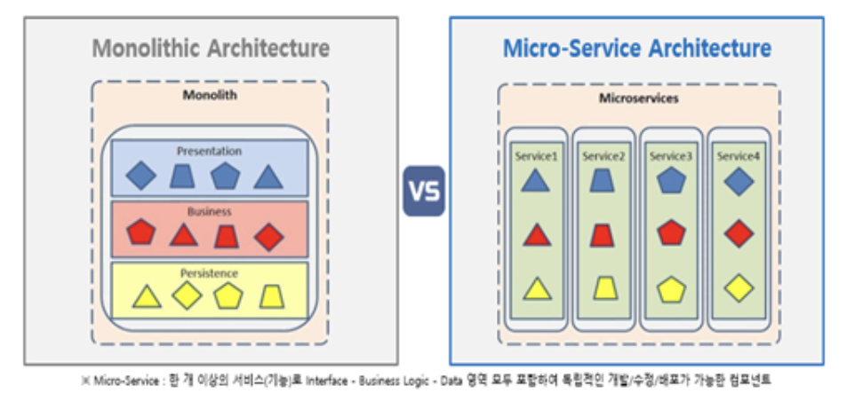

이번 스터디에서는 `아키텍쳐` 중에서 MicroServiceArchitecture (MSA) 에 대해 자세히 알아본다

---

## MSA란?

- MicroServiceArchitecture의 줄임말
- 마이크로서비스는 작고, 독립적으로 배포 가능한 각각의 기능을 수행하는 서비스이다
- 마이크로서비스는 완전히 독립적으로 배포가 가능하다.

---

## MSA의 등장 배경



기존의 모놀리식 아키텍처같은 경우 일정 규모 이상의 서비스, 혹은 수백명 이상의 개발자가 투입되는 프로젝트에서는 여러가지의 한계점이 있다

#### 부분장애가 전체장애로 확대될 수 있다

- 개발자의 잘못된 코드 배포 또는 갑작스런 트래픽 증가로 인해 문제가 생겼을 때, 서비스 전체의 장애로 확대될 수 있다.

#### 부분적인 Scale-Out이 어렵다

- Monolithic Architecture에서는 사용되지 않는 다른 모든 서비스가 Scale-out되어야 하기 때문에 부분 Scale-out이 어렵다.

#### 서비스의 변경이 어렵고 수정 시 장애의 영향 파악도 힘들다

- 여러 컴포넌트가 하나의 서비스에 강하게 결합되어 있기 때문에 수정에 대한 영향도 파악이 힘들다.

#### 배포시간이 오래걸린다

- 많은 사람이 하나의 시스템을 개발하여 배포하기 때문에 배포시간에 영향을 준다.

#### 한 프레임워크와 언어에 종속적이다

- Spring을 사용하는 경우 java외의 다른 언어를 사용하지 못하였다

이런 모놀리식 아키텍처의 문제점을 보완하기 위해 MSA가 나오게 되었다.

---

## MSA의 특징

- MSA는 API를 통해서만 서비스끼리 상호작용할 수 있다.
- 마이크로서비스의 end-point를 API 형태로 외부에 노출하고, 실질적인 세부사항은 모두 추상화한다
- SOA(Service Oriented Architecture)의 특징을 다수 공통으로 가진다

```
SOA - 대규모 컴퓨터 시스템을 구축할 때의 개념으로, 업무상 일 처리에 해당하는 소프트웨어 기능을 서비스로 판단하고 그 서비스를 네트워크상에 연동하여 시스템 전체를 구축해 가는 방법론이다. 업무 처리 변화를 시스템에 빠르게 반영하고자 하는 수요에 대응하기 위해 2004년부터 IT 업계에서 주목 하고 있다.
```

- 제대로 설계된 마이크로서비스는 하나의 비즈니스 범위에 맞춰 만들어지므로 하나의 기능만 수행한다.
- 마이크로서비스 기반의 어플리케이션은 다양한 프레임워크와 언어, 기술로 구출할 수 있다.

---

## MSA의 장단점

### 장점

- 각각의 서비스는 모듈화가 되어있으며, 각 모듈마다 서비스 개발을 빠르게 하며, 유지보수도 쉽게할 수 있다.
- 마이크로서비스는 서비스별로 독립적 배포가 가능하다.

### 단점

- 모놀리식에 비해 상대적으로 많이 복잡하다.
- 통합 테스트가 어렵다.
- 실제 운영환경에 대해서 배포하는 것이 쉽지 않다.

---

#### 다음 시간에는 MSA를 사용한 서비스에 대해 예를 들어 더욱 자세히 알아보겠습니다

**references**

- https://kr.tmaxsoft.com/info/storyTView.do?seq=345
- https://wooaoe.tistory.com/57
