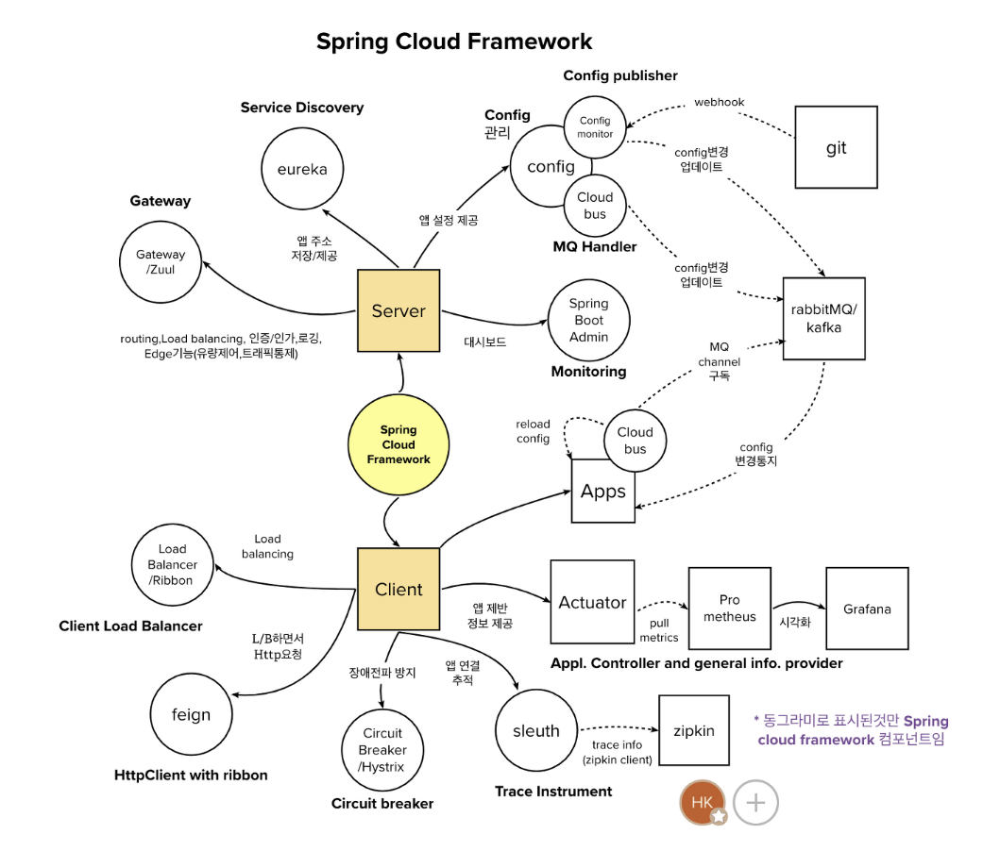
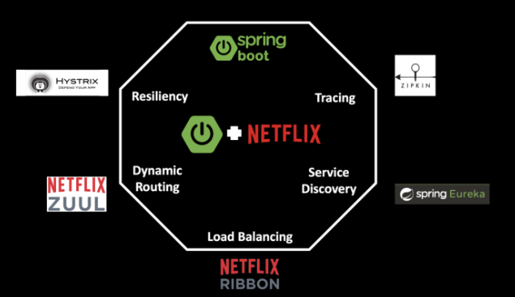
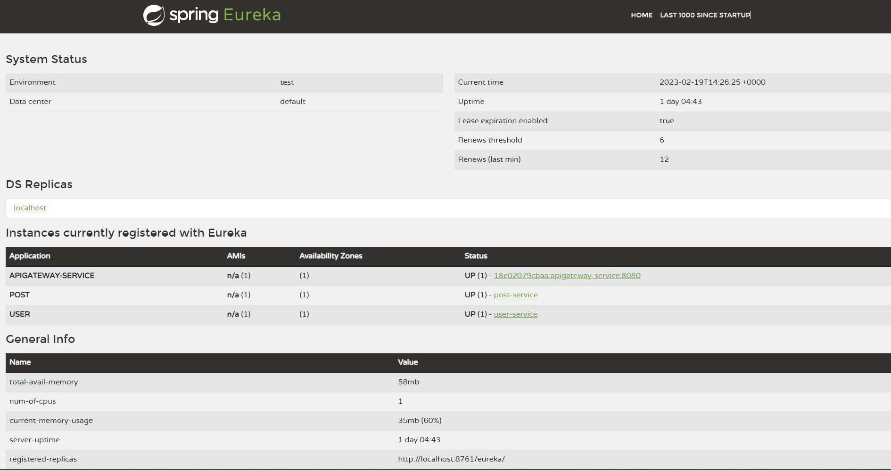

이번 스터디에서는 `MSA` 를 사용하는 프레임워크 중 `Spring Cloud`에 대해 공부해보겠습니다.

## Spring Cloud란?

- MSA 구성을 지원하는 SpringBoot 기반의 프레임워크
- 의존성 추가 및 어노테이션 추가만으로 구성을 할 수 있음



Spring Cloud는 Netflix OSS를 많이 받아들였는데 Netflix OSS 일부를 Spring Cloud Netflix 프로젝트로 제공을 한다.

```
Netflix OSS - Netflix에서 MSA를 운영하며 쌓아온 노하우들을 오픈소스로 공개한 것이다.
```



## Spring Cloud 종류

### Spring Cloud Netflix Eureka

- 서비스의 Discovery Pattern을 위해 만들어 진 것이다
- Eureka Client와 Eureka Server로 구성이 되어있다.



### Spring Cloud Config

- 설정 외부화를 위해 만들어 진 것이다
- Eureka Client에서 설정 서버로 부터 정보를 조회한다.

### Spring Cloud Netflix Hystrix

- MSA 환경에서 장애가 일어났을 때 다른 서비스로 장애가 전파되지 않도록 사전에 차단해주는 것이다.

### Spring Cloud Netflix Zuul

- 간단하게 Gateway 역할을 하기 위해 만들어 진것이다
- 클라이언트의 호출을 받아 뒷단의 마이크로 서비스에 전달된다.
- 모든 서비스들이 공통적으로 처리해야하는 코드를 처리해준다 (Filter 등)

## Spring Cloud의 한계

자바로 만들어진 스프링 프로젝트에서만 주로 사용이 가능하다  
MSA의 장점 중 여러가지의 프레임워크를 사용할 수 있다는 것이 조금 어려워질 수도 있다.

## 예제 코드

### Discovery Service (Spring Cloud Netflix Hystrix, Eureka)

---

build.gradle

```gradle
ext {
	set('springCloudVersion', "2021.0.5")
}

dependencies {
    implementation 'org.springframework.cloud:spring-cloud-starter-netflix-eureka-server'
}

dependencyManagement {
	imports {
		mavenBom "org.springframework.cloud:spring-cloud-dependencies:${springCloudVersion}"
	}
}
```

---

Application.java

```Java
@SpringBootApplication
@EnableEurekaServer
public class DiscoveryApplication {
    public static void main(String[] args) {
		SpringApplication.run(DiscoveryServiceApplication.class, args);
	}
}
```

---

application.yml

```application.yml
server:
  port: 8761

spring:
  application:
    name: discovery-service

eureka:
  client:
    register-with-eureka: false
    fetch-registry: false
```

---

### Config Service (Spring Cloud Config)

---

build.gradle

```gradle
ext {
	set('springCloudVersion', "2021.0.5")
}

dependencies {
	implementation 'org.springframework.boot:spring-boot-starter-actuator'
	implementation 'org.springframework.cloud:spring-cloud-starter'
	implementation 'org.springframework.cloud:spring-cloud-config-server'
}

dependencyManagement {
	imports {
		mavenBom "org.springframework.cloud:spring-cloud-dependencies:${springCloudVersion}"
	}
}
```

---

Application.java

```Java
@SpringBootApplication
@EnableConfigServer
public class ConfigServiceApplication {

	public static void main(String[] args) {
		SpringApplication.run(ConfigServiceApplication.class, args);
	}
}
```

---

application.yml

```yml
server:
  port: 8888

spring:
  application:
    name: config-server
  cloud:
    config:
      server:
        git:
          uri: [github 레포지토리 주소]
management:
  endpoints:
    web:
      exposure:
        include: "*"
  endpoint:
    shutdown:
      enabled: true
```

---

### APIGateway Service (Spring Cloud Netflix Zuul)

---

build.gradle

```gradle
ext {
	set('springCloudVersion', "2021.0.5")
}

dependencies {
	implementation 'org.springframework.cloud:spring-cloud-starter-gateway'
	implementation 'org.springframework.cloud:spring-cloud-starter-netflix-eureka-client'
}

dependencyManagement {
	imports {
		mavenBom "org.springframework.cloud:spring-cloud-dependencies:${springCloudVersion}"
	}
}
```

---

Application.java

```Java
@SpringBootApplication
@EnableEurekaClient
public class ApigatewayServiceApplication {

	public static void main(String[] args) {
		SpringApplication.run(ApigatewayServiceApplication.class, args);
	}

}
```

---

application.yml

```yml
server:
  port: 8080

spring:
  application:
    name: apigateway-service
  cloud:
    gateway:
        default-filters:
        - name: GlobalFilter
        args:
          baseMessage: Hello Spring Cloud Gateway Global Filter
          preLogger: true
          postLogger: true
      routes:
        - id: [service name]
          uri: [service uri]
          predicates:
            - name: Path
              args:
                patterns: [uri pattern]
            - name: Method
              args:
                methods: [http method]

eureka:
  client:
    register-with-eureka: true
    fetch-registry: true
    service-url:
      defaultZone: [eureka 서비스 url]
```

---

### Business Service (Spring Cloud Netflix Eureka)

---

build.gradle

```gradle
ext {
	set('springCloudVersion', "2021.0.5")
}

dependencies {
	implementation 'org.springframework.boot:spring-boot-starter-actuator'
	implementation 'org.springframework.cloud:spring-cloud-starter-config'
	implementation 'org.springframework.cloud:spring-cloud-starter-netflix-eureka-client'
}

dependencyManagement {
	imports {
		mavenBom "org.springframework.cloud:spring-cloud-dependencies:${springCloudVersion}"
	}
}
```

---

Application.java

```Java
@SpringBootApplication
@EnableEurekaClient
public class UserServiceApplication {

	public static void main(String[] args) {
		SpringApplication.run(UserServiceApplication.class, args);
	}

}
```

---

application.yml

```yml
spring:
  application:
    name: user
  profiles:
    active: config
  config:
    import: optional:configserver:[config server url]

eureka:
  instance:
    instance-id: [service 고유 아이디]
  client:
    service-url:
      defaultZone: [eureka 서비스 url]
    fetch-registry: true
    register-with-eureka: true
```

---

**references**

- https://velog.io/@sorzzzzy/MSA-MSA%EB%A5%BC-%EC%9C%84%ED%95%9C-%EA%B8%B0%EC%88%A01-Spring-Boot-Spring-Cloud-Docker
- https://happycloud-lee.tistory.com/207
- https://bravenamme.github.io/2020/07/21/msa-netflix/
- https://bcho.tistory.com/1252
