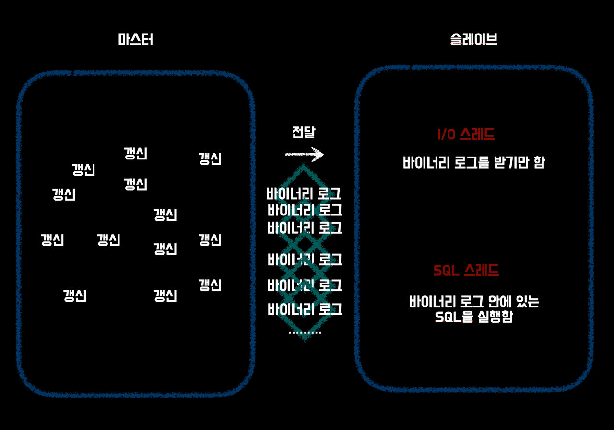
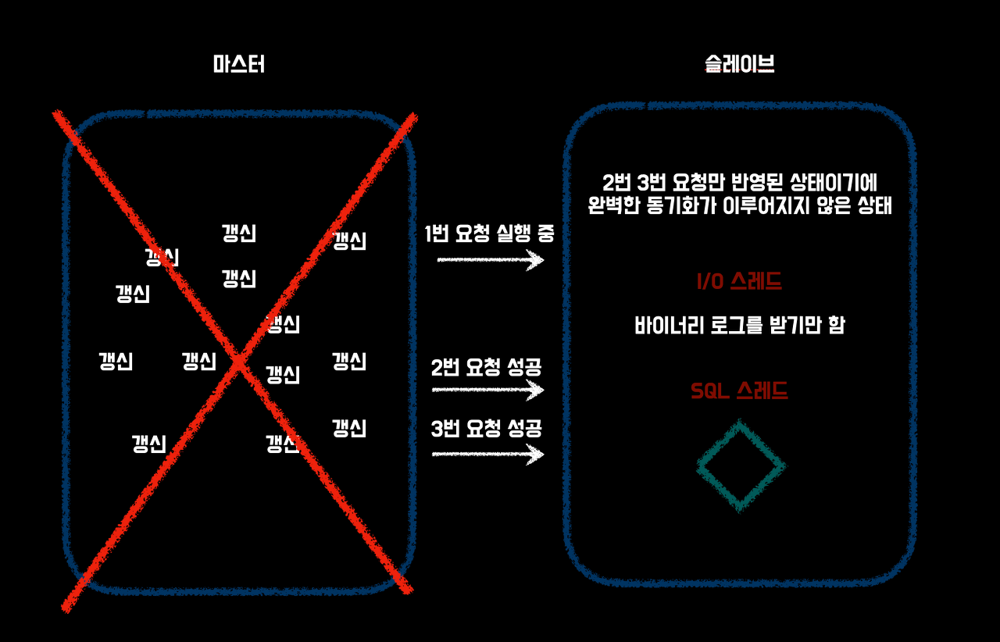
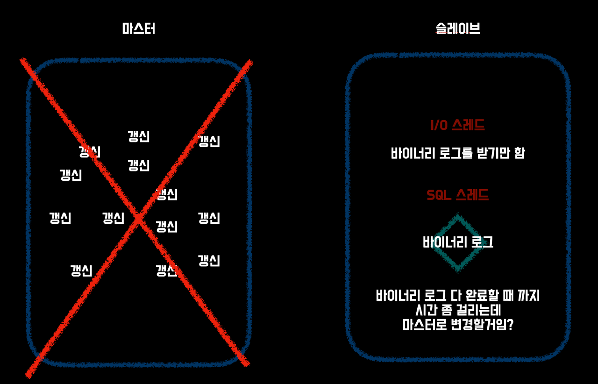

## Availability
데이터베이스가 crash(손상)되었을 때 어떻게 해야 서비스를 다운시키지 않고 계속 운영할 수 있을까? 현재 가장 많이 사용하는 방법은 replication(복제)이다.

하지만 데이터베이스에 크래쉬가 일어났을 때 어느 정도의 데이터 로스(data loss)를 허용할지에 따라 방침이 변한다.

# 전형적인 장애 시나리오
장애 대책을 세워놓기 위해서는 어떤 장애가 일어날 수 있는지를 먼저 알아야 한다. 대표적인 장애 패턴을 알아보자

## 소프트웨어 장애
데이터베이스 프로그램의 폭주와 충돌처럼 소프트웨어 주변의 결함으로 인해 서비스를 제공할 수 없는 유형의 장애다. 문제의 심각성에 따라서 데이터 자체가 파괴되어 다시 시작되지 않는 등 치명적인 유효타를 받을 수 있다.

소프트웨어 장애는 그 소프트웨어의 품질이 장애 빈도와 심각성에 결정적인 영향을 미친다. 오픈 소스와 상용 제품이라고 해서 성능이나 안정성이 안 좋을 거라는 판단보다는 제품을 평가하는 데에 있어서 기능과 성능 뿐 아니라 품질 또한 중요하다는 것을 알아야 한다.

## OS 장애
우리가 흔히 볼 수 있는 Windows의 블루 스크린 또는 Linux의 커널 패닉과 같은 OS 주변의 장애로 인해 서비스를 제공할 수 없는 유형의 장애다.

일반적으론 소프트웨어 장애로 분류되지만, 문제 해결에는 OS 및 하드웨어 주변의 고급 기술이 요구되기 때문에 RDBMS와 같은 미들웨어 장애와는 또 다른 어려움 존재한다. 발생 빈도에 있어서도 OS 장애로 인하여 서비스를 제공할 수 없게 되는 경우가 드물지 않다.

현실적으로 발생 빈도가 높은 문제로서는 장치 드라이버의 버그가 있다. 예를 들어 과부하 처리가 일정 시간 이상 지속 후 갑자기 디스크 액세스를 전혀 할 수 없게 되는 문제가 발생하기도 한다.

우리가 OS를 새로 설치할 때 오래된 버전의 드라이버가 설치되는 경우가 많은데, 최신 버전의 드라이버로 유지할 수 있도록 상시 업데이트 하도록 하자.

커널 패닉? OS에서 심각한 오류가 발생하여 프로세스를 중지하는 것이다. Windows 운영체제의 블루 스크린과 비슷한 의미이다.

## 하드웨어 장애
OS 및 소프트웨어 주변의 장애는 결함을 제거하기만 한다면 장애를 막아낼 수 있는 문제다. 하지만 하드웨어의 경우 장애를 완벽하게 막아내기 힘들다.

HDD와 같이 물리적으로 작동하는 것은 수명이 2~3년 정도로 그다지 길지 않다. 그것이 1,000대 규모의 서버에서 운영되고 있다면 하루 한 대는 어느 서버에선가 고장이 나는 일이 발생하게 될 수도 있다.

많은 트래픽이 발생하는 서비스 공급자라면 이러한 하드웨어 장애는 언젠간 맞닥뜨리게 될 수밖에 없다.

## 조작 실수
테이블을 실수로 지우거나 쿼리를 잘못 사용하는 등, 조작 실수에 의한 장애가 발생하는 경우도 많다. 물론 방지할 수 있다면 방지하는 것이 제일 베스트지만, 많은 사람들이 개발에 contiribute 할수록 이런 문제가 일어날 확률이 높아진다.

참고로 조작 실수로 인한 장애는 종종 복구 과정이 매우 복잡한 경우가 있다.

디스크 이중화로 데이터 손실 방지하기
위에서 언급한 장애들 뿐만 아니라 수 많은 장애들이 우리의 데이터베이스를 위협하고 있다. 그렇다면 우리는 수많은 장애들을 어떻게 방어할 수 있을까?

지금까지 언급한 문제를 발생시키지 않는 것이 최선이겠지만, 현실적으로 장애가 없는 서비스를 만드는 것은 불가능하다. 장애 방어 대책 중 가장 효율이 좋은 것은 데이터 손실 방지일 것이다.

만약 서버가 복구 되었다고 하더라도 데이터 정합성에 문제가 생긴다면 필요한 데이터가 없을 수 있기 때문에 서비스를 정상적으로 운영할 수 없을 것이다.

보통 장애가 일어났을 때 디스크 이중화 방식으로 데이터의 손실을 방지한다. 디스크 이중화가 어떻게 데이터의 손실을 최대한 줄일 수 있을지 알아보자.

# RAID
데이터베이스의 데이터는 HDD에 저장되는 것이 보통 방식이다. 그러나 HDD는 모든 하드웨어 부품 중에서 고장률이 가장 높은 부품이다. 그래서 하나의 서버에 여러 개의 HDD를 장착하고 동일한 데이터를 두 개 이상의 HDD에 분산시키며 데이터 손실률을 최소화하고 있다.

이 기술을 RAID라고 하는데, 디스크 한 개가 망가져도 서비스를 운영할 수 있을 정도로 데이터를 제공할 수 있다는 것이다. 보통 HDD 용량에 여유가 있으면 RAID1, 여유가 별로 없다면 RAID5를 사용하는 것이 일반적이다.

> 방식	설명
* **RAID 0(스트라이핑)** : 복수의 HDD에 데이터를 기록하여 읽고 쓰기를 **고속화**시키는 방식이다.
  이용 가능 용량은 디스크 개수만큼이다.
* **RAID 1(미러링)** : 두 개의 HDD에 동일 데이터를 작성하는 방식이다.
  이용 가능 용량은 **디스크 수의 절반**이다.
* **RAID 5** : 오류 정정 부호인 패리티 데이터와 함께 분산하여 기록하는 방식이다.
  이용 가능 용량은 N개의 경우 **N - 1개**가 된다.
* **RAID 6** : 오류 정정 부호인 패리티를 두 개 생성하고 데이터와 함께 분산하여 기록하는 방식이다.
  이용 가능 용량은 N - 2개가 된다.

RAID의 구성에 따라 다르지만, 한 개가 망가진 상태에서 방치하면 **성능이 크게 저하**될 수 있고, 그대로 두 번째가 손상되면 데이터 손실의 위험이 있다. 그래서 HDD가 하나라도 손상된 경우 서비스를 멈추지 않고 망가진 HDD와 새로운 HDD를 교체하여 복구하는 **핫 스왑**이라는 기술도 병용된다.

# 서버 이중화에 의한 다운 타임 줄이기
실제로는 RAID를 사용하는 것만으로는 서비스를 운영하는 데에 있어서 충분하지 않을 수 있다. 장애의 원인이 되는 것은 디스크만이 아니기 때문이다. **CPU 고장, 커널 패닉도 있으며, 데이터베이스 프로세스 장애**도 있다.

RAID 구성을 짜고 있다 해도 서버가 하나 밖에 없다면 시스템은 즉시 다운될 수밖에 없다. 따라서 서버에 문제가 생겨도 서비스를 다운시키지 않고 싶다면 **무조건 서버를 두 대 이상 가지고 있어야 한다.**

어느 하나가 크래쉬가 발생한 경우에도 남은 한 대를 사용하여 적어도 서비스를 지속할 수 있을 것이다. 웹 서비스를 중심으로 현재 가장 널리 사용되고 있는 중복화 방식이 **복제(replication)**다.

복제는 문자 그대로 복제본을 다른 서버에 생성하는 기술로, 하나의 서버가 다운되어도 나머지 서버에 동일한 데이터가 있기 때문에 서비스를 계속할 수 있다.

복제에는 다양한 유형이 있어 성능을 희생하고 데이터의 무결성을 중시하는 방법도 있지만, 성능을 최대한 챙기고 약간의 데이터 무결성을 포기하는 방법도 있다.

# 단방향 복제
## 비동기
단방향/비동기 복제는 데이터베이스 상에서 마스터에서 갱신한 결과가 슬레이브에 비동기로 전파하는 유형의 복제다. 이 방법은 Mysql 데이터베이스에서 표준으로 사용되는 복제 기능이다.

예를 들어 Mysql에서는 마스터에서 실행한 갱신계의 SQL 문이 바이너리 로그라는 전용 로그 파일로 기록된다. 이 로그 파일의 내용이 슬레이브로 전송되어 저장된다.

슬레이브가 바이너리 로그 파일을 수신하면 순차적으로 실행함으로써 마스터와 슬레이브의 상태가 일치되는 구조가 된다. 슬레이브는 바이너리 로그 파일을 수신하는 스레드와 바이너리 로그 파일 안에 있는 SQL 문을 실행하는 스레드가 따로 존재한다.

로그 파일을 수신하는 스레드는 I/O 스레드이며 로그 파일 안에 있는 SQL 문을 실행하는 스레드는 SQL 스레드이다. 디스크와는 다르게 네트워크는 병목 현상이 적기 때문에 수신은 거의 동기에 가깝게 진행된다.

하지만 SQL문을 실행하는 과정에서 데이터베이스의 테이블에 액세스하여 내용을 변경할 수 있다는 성질상 디스크가 병목현상을 일으키면 처리가 늦어질 수밖에 없다.

또한 마스터가 장애를 일으킨 경우 슬레이브에서는 지금까지의 업데이트 결과가 반영되지 않을 수 있다. 이 반영되지 않는다는 상황은 다음 두 가지 패턴이다.

* 마스터에서 생성한 바이너리 로그 파일이 슬레이브에서 마지막까지 수신되지 않은 경우
* 슬레이브에서의 바이너리 로그 파일의 실행이 마지막까지 종료되지 않은 경우

첫 번째 상황은 I/O 스레드가 비동기이기 때문에 발생할 수 있는 현상이다. 마스터는 이미 죽어 있기 때문에 최근의 바이너리 로그를 전송할 수 있는 서버가 없다. 이 경우 슬레이브가 수신한 최종 결과와 마스터의 최종 결과 사이의 데이터가 손실될 수 있다.

위에 있는 사진으로 볼 때 1번, 2번, 3번 요청들 중에서 1번 요청이 오래 걸리는 상황이다. 2번 3번 요청은 정상적으로 처리되어 슬레이브는 1번 요청만 처리하면 최근의 데이터 변경까지 처리하여 완벽한 동기화가 될 것이다.

하지만 1번 요청을 실행하는 도중 마스터에 장애가 일어난다면 1번 요청이 적절히 처리되지 못하고 처리되지 못한 부분의 데이터는 슬레이브에 반영되지 않을 것이다.

하지만 Mysql만 크래쉬되었을 뿐이지 OS는 살아있을 수 있기 때문에, 이 경우 SSH에 접속하여 바이너리 로그를 가져오는 행위도 가능해 실제로 그렇게 손실된 데이터를 복구하는 방법도 있다.

두 번째 상황은 슬레이브의 SQL 스레드가 지연되기 때문에 일어나는 현상이다. 슬레이브는 바이너리 로그를 받을 수 있기 때문에 마스터가 죽어 있어도 슬레이브에 저장된 바이너리 로그를 사용하여 지연의 해소가 가능하다.

마스터가 죽었을 경우 시스템을 슬레이브로 옮겨 해당 슬레이브를 마스터로 변경하는 작업을 해야 할 것이다. 하지만 아직 실행되지 않은 바이너리 로그들이 있을 경우 부분적으로 데이터 불일치가 생길 위험이 있다.

따라서 제대로 복구를 하려면 슬레이브가 바이너리 로그를 마지막까지 실행한 것을 확인하고 나서 업데이트 트래픽을 옮길 필요가 있다. 이것을 수동으로 실행하려고 하면 복잡하지만, 이런 작업을 자동화해 주는 도구도 존재한다고 한다.

## 준동기
위에서 설명한 마스터-슬레이브 데이터 복제 방식은 **1. 슬레이브가 바이너리 로그를 수신 2. 바이너리 로그의 내용을 실행**이라는 두 개의 단계로 이루어져 있으며, 비동기 방식으로 처리된다고 했다.

새로운 버전의 Mysql에서는 이 중 1번 과정을 동기화 방식으로 처리할 수 있다. 이것을 **준동기식 복제(semi-synchronous replication)**라고 한다.

1번 과정이 동기 방식으로 됨으로써 마스터를 업데이트한 클라이언트는 그 결과를 마스터의 데이터베이스 상에서 확정하는 것 뿐만 아니라 대상 슬레이브로 전송하여 그 확인 응답이 반환될 때까지 대기해야 한다.

따라서 클라이언트에서 응답을 받았을 때 그 업데이트가 슬레이브에 도착해 있는 것이 보증된다. 이에 따라 마스터 손실에 의한 데이터 손실의 위험을 부분적으로 낮출 수 있다.

하지만 마스터 슬레이브 간의 로그 바이너리가 동기 방식으로 처리되기 때문에 비동기 방식으로 처리하는 것 보다 응답 시간이 길어진다. 준동기 데이터 복제는 데이터의 손실의 위험과 응답 시간의 악화에 대해 균형을 취한 현실적인 방법이라고 할 수 있다.

## 동기
현재 Mysql 데이터베이스에서는 구현되어 있지 않지만, 슬레이브에 대해 업데이트 결과의 반영까지 마친 상태에서 처음으로 클라이언트에 응답을 반환하는 방식도 생각할 수 있다.

마스터-슬레이브를 동기식으로 처리한다면 마스터에 장애가 일어났을 때 슬레이브로 즉시 변경할 수 있다는 장점이 있다. 하지만 동기화의 단점이 그렇듯 처리 속도가 느려지는 것을 감수해야 한다.

# 양방향 복제
지금까지 설명한 복제 구성에서 마스터-슬레이브는 단방향이라는 제약이 있었기에 업데이트는 마스터에서만 할 수 있었다. 또한 대부분의 경우에서 슬레이브는 단일 스레드로 복제를 담당하게 되어 있으므로 갱신의 동시성이 없다.

위에서 슬레이브가 단일 스레드로 복제를 담당한다고 했는데, 이 말은 슬레이브의 스레드들 중에서 복제만을 담당하는 스레드가 단일이라는 뜻이다.

최근의 하드웨어는 SSD와 멀티코어 CPU와 같이 여러 스레드에서의 병렬성을 높일 수 있도록 되어 있기 때문에 그 혜택을 받을 수 없다는 것은 문제가 될 수 있다. 그래서 마스터를 두 개 이상 갖게 하고 각각의 마스터를 업데이트할 수 있도록 한다는 구성을 생각할 수 있다.

## 양방향 복제의 기술적 한계
성능 면에서의 양방향 복제는 매우 우수하다. 하지만 양방향 복제는 기술적인 과제가 매우 많이 남아있는 단계이다. 특히 업데이트의 컨플릭트에 대해서 매우 민감한데, 업데이트가 동시에 이루어지게 된다면 데이터 불일치라는 안 좋은 결과를 낳기 때문에 그것을 방지하는 분산형 배타 제어의 구조가 필요하다.

**Mysql Cluster** 제품에서는 동기 복제를 구현하고 있어서 A -> B, 다른 세션에서는 B -> A의 순서로 업데이트를 하는 동안 동일한 ID를 B로 업데이트할 수 없게 되어 있다.

양방향, 비동기 복제에서는 애플리케이션 로직으로 배타 제어해야 할 필요가 있는 부분을 데이터베이스 측에서 배타 제어를 해주는 것이 좋다.

# 장애 복구 방법
장애가 발생한 후 죽어버린 서버를 복구하는 방법을 알아보자. 예를 들어 슬레이브가 장애를 일으켜 못쓰게 된 경우를 생각해 보자. 슬레이브 하드웨어 오류로 인해 해당 서버의 데이터를 소실했을 경우, 다른 살아있는 슬레이브 또는 마스터에서 데이터를 복원하거나 정기적으로 백업을 받았다면 그것으로 되돌릴 수밖에 없다.

또는 OS 장애 등에 의해 일시적으로 사용할 수 없게 되었으나 데이터 자체는 디스크에 남아있는 유형도 있다. 이때는 그냥 다시 시작하면 복제를 재개해 줄 수 있을 수 있지만, 운용의 설정이 적절하지 않다면 필요한 데이터가 남아있지 않아 복제를 재개할 수 없거나 불일치를 일으키게 한다.

또한 마스터-슬레이브 방식에서 슬레이브에 문제가 생긴다면 보통 해당 슬레이브를 완전히 삭제하고 새로운 슬레이브를 만들어 가장 최근의 바이너리 로그를 적용한다.

하지만 보통의 바이너리 로그 파일의 양은 만만치 않다. 예를 들면 스토리지 읽기 속도가 초당 80MB, 쓰기 속도가 초당 60MB, 네트워크 전송 속도가 초당 100MB일 때 1TB 용량의 슬레이브를 복사하는데 10시간 이상이 걸린다.

따라서 향후 슬레이브 복구 방법 트렌드로써는 전체 데이터베이스를 복사하여 복구하는 것이 아닌 장애 시점과 현시점과의 차이만을 복구하는 방법으로 변경될 것이다.

Mysql Cluster 등 고도의 데이터베이스의 경우는 단순히 장애를 일으킨 서버를 재기동하는 것 만으로도 자동적으로 미반영의 데이터를 특정하여 차분만을 복구해 준다.

## 인위적 실수에 대한 해결
장애 대책으로서 반드시 생각해야 할 시나리오 중 하나로 인위적 실수가 있다. 예를 들어 실수로 테이블을 지워버렸을 때, 데이터베이스 백업을 통해서 해결할 수 있다.

하지만 백업이라는 행위 자체가 데이터베이스를 그대로 복사하는 것이기 때문에 매우 무거운 작업이다. 따라서 하루에 한 번, 서버에 가장 부하가 적은 새벽 시간대에 백업을 하는 편이다.

하지만 마지막 백업으로부터 어느 정도의 시간이 지난 후 데이터가 손실되면 문제가 발생할 수 있는데 이 또한 데이터베이스에서 지원하는 **시점 복구(Point In Time Recovery, PITR)** 기능이 문제를 해결해주고 있다.

# 번외
이번 포스팅에서는 데이터베이스에 장애가 일어났을 때 방어 방법으로 복제 구성만을 다루었지만, 이외에도 **Active/Stanby**라는 구성을 사용해서 하드웨어가 단일 장애점이 되는 것을 방지할 수 있다.

다만, Standby 하고 있는 시스템이 일반적으로는 가동되지 않고 하드웨어가 절반은 쓸모없게 되어 버리기 때문에 웹 서비스에서는 그다지 사용하지 않는다.

하지만 트래픽이 크지 않고, 높은 가용성이 요구되는 환경에서는 오히려 유용할 수 있다. (ex 사내 애플리케이션)