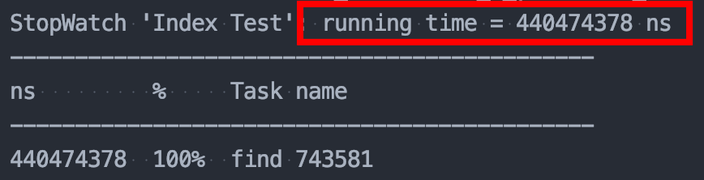
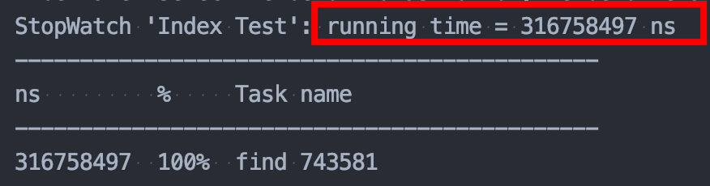
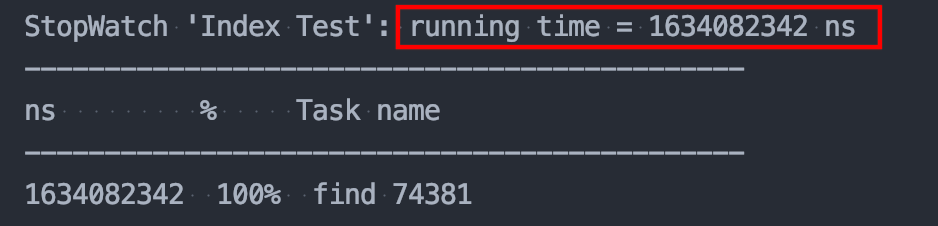
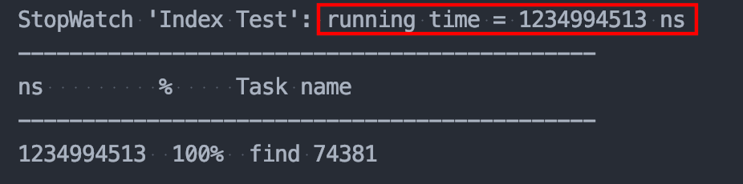
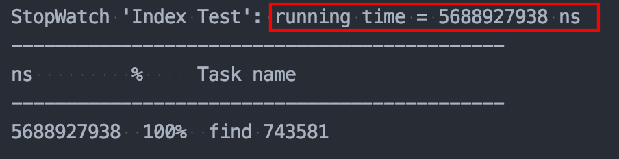
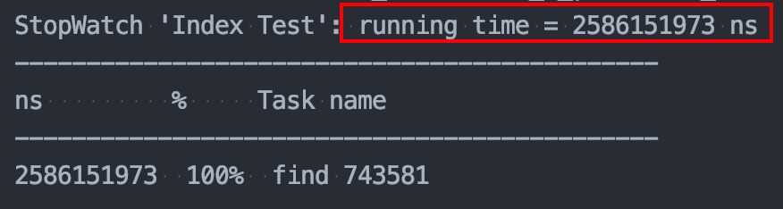

데이터베이스는 조건문으로 검색할 때, 테이블 전체를 `Full Scan`으로 탐색한다. 
이러한 탐색 방식은 데이터가 많아지면 많아질 수록 `비효율적인 방식`이라는 것을 알 수 있을 것이다.

실제로 `JPA`를 활용해 인덱스를 사용해보면서 얼마나 효과가 있는지 확인해보자.

## 조회 속도 비교
테스트 코드는 간단하다. 유저 엔티티에 인덱스로 사용할 컬럼명을 작성해준다.


### 간단한 인덱스 문법
> `@Index`의 속성은 name과 columnList로 이루어져 있다. 역할은 다음과 같다. <br>
* name : 내가 설정할 인덱스 집합의 이름이다. <br>
* columnList : index로 설정할 컬럼명이다. 하나의 name에 여러 컬럼을 적용하고 싶을 시 `,`로 구분한다. <br> 

#### 인덱스 적용하기 
```java
@Table(indexes = @Index(name = "idx_name_email", columnList = "name, email"))
```

#### 여러개의 인덱스 추가하기
```java
@Table(indexes = 
        @Index(name = "idx_name_email", columnList = "name, email"), 
        @Index(name = "idx_creaedAt_age", columnList = "createdAt, age")
)
```

#### 유니크 속성 추가하기

`unique = true` 옵션을 넣어주면 `Unique Index`로 생성된다.
`default는 false`이기 때문에 unique 옵션을 넣지 않으면 기본 인덱스로 생성된다.

```java
@Table(indexes = 
        @Index(name = "idx_name_email", columnList = "name, email"), 
        @Index(name = "idx_creaedAt_age", columnList = "createdAt, age"),
        unique = true
)
```

이렇게 인덱스를 설정하고 나면 아래와 같은 쿼리가 나가는 것을 볼 수 있다.


그렇다면 이제 인덱스가 얼마나 효과가 있는지 확인해보자.

> 속도는 mysql `profile`을 사용하며 더미데이터는 `프로시저`를 사용한다.

먼저, 회원수 `100명`일 때 이름에 대한 인덱스를 사용했을 때와 사용하지 않았을 때, 조회 시 걸린 속도를 비교이다.

## 회원 수 100명 일 때
### 👉 인덱스 미사용 : 0.44s


### 👉인덱스 사용 : 0.31s


데이터가 작을 때는 별차이가 없어보인다. 그럼 데이터를 늘려보자.

## 회원 수 100,000명 일 때
### 👉 인덱스 미사용 : 1.63s


### 👉 인덱스 사용 : 1.23s


## 회원 수 500,000명 일 때
### 👉 인덱스 미사용 : 5.69s


### 👉 인덱스 사용 : 2.59s



데이터가 점점 늘어날 수록 인덱스를 사용할 때와 사용하지 않았을 때의 차이가 점점 늘어나는 것을 확인할 수 있다. 
데이터가 50만개일 때는 차이가 `2배`도 넘게 나는 것을 확인할 수 있었다.

## 결론
인덱스를 과도하게 설정하면 그 자체만으로도 메모리 공간을 많이 차지하지만, 
테이블이 변경될 때마다 인덱스의 정렬 순서도 매번 수정이 되어야하므로 이 역시 `비효율`적이다.