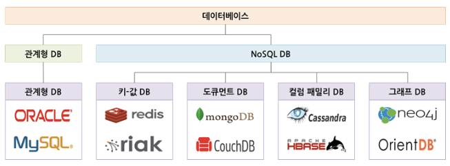

이번 스터디에서는 `데이터베이스 종류` 중에서 SQL만을 사용하지 않는 데이터베이스 관리시스템 (DBMS) 에 대해 자세히 알아본다

---

## NoSQL이란?

- Not Only SQL : SQL 만을 사용하지 않고 여러 유형의 데이터베이스를 사용하는 데이터 베이스 관리 시스템
- 다른 특성을 부가적으로 지원하는 데이터베이스
- 클러스터에서 실행할 목적으로 만들어졌기 때문에 관계형 모델을 사용하지 않는다
- 대부분 오픈소스로 사용 중이다
- 스키마 없이 동작하며, 구조에 대한 정의를 변경할 필요 없이 데이터베이스 레코드에 자유롭게 필드를 추가할 수 있다

---

## NoSQL의 등장 배경

지난 20년간, 사람들은 `관계형 데이터베이스`를 주로 사용하였다.
하지만 웹 2.0 환경과 빅데이터가 등장하며 RDBMS는 데이터를 처리하는 데에 필요한 비용의 증가로 인해 난관에 부딪히게 되었다.
데이터와 트래픽의 양이 기하급수적으로 증가함에 따라 한대의 데이터베이스 서버에서 실행되도록 설계된 관계형 데이터베이스를 사용하는 것은 하드웨어적으로 큰 비용이 들게 되었다. 또한 장비의 성능이 좋을수록 성능을 향상 시킬때 (Scale-up : 수직적 확장) 의 비용이 기하급수적으로 증가하였다

`NoSQL`은 데이터의 일관성을 약간 포기하였지만 여러 대의 컴퓨터에 데이터를 분산하여 저장하는 것 (Scale-out : 수평적 확장) 을 목표로 등장하였다.

`NoSQL`의 등장으로 작고 `갑싼 장비 여러 대`로 대량의 데이터와 컴퓨팅 부하를 처리하는 것이 가능하게 되었다.

#### RDBMS가 Scale-out에 좋지 않은 이유

- RDBMS가 Scale-out을 하게 될 경우 데이터의 일관성을 잃어버리게 된다.
- 관계가 생길수록 데이터가 늘어날수록 RDB에서는 수평확장에 대한 관리가 복잡해진다.
- 정상적인 Join과 ACID 트랜잭션 기능을 사용할 수 없게 된다.

---

## NoSQL의 특징

### 일관성과 확장성 사이의 Trade-off

일관성이 데이터베이스의 절대적인 요소가 아님을 주장하는 사람들이 생기기 시작하였다. 이 사람들은 비일관성이 다음과 같은 두가지의 이유로 감수할 만한 것이라고 주장하였다.

1. 다수가 동시에 읽고 쓰는 (Read and Write) 상황에서의 성능 향상을 위해
2. 분산 환경에서 노드들이 잘 작동하고 있음에도 시스템의 일부가 고장나면 데이터베이스를 사용할 수 없게 되는 문제를 해결하기 위해

### 분산 저장

데이터와 트래픽이 증가함에 따라 기존 장비로는 원할한 데이터의 처리가 어려워졌다.  
해결하기 위한 방법으로는 장비의 성능을 키우는 수직적 확장(Scale-Up)과 처리하는 장비 수를 늘리는 수평적 확장(Scale-Out)이 있다

문제는 관계형 데이터베이스 (RDBMS)는 클러스터 상에서 효율적으로 동작할 수 있도록 설계되지 않았다는 점이다

NoSQL 기반 데이터베이스의 경우 집합-지향 모델을 사용하여 이런 문제를 해결한다.

### 데이터 일치

Impedance mismatch : 관계형 모델과 메모리 내 데이터 구조 간에 존재하는 데이터 불일치

NoSQL은 메모리 내의 데이터가 어떤 구조이던 상관하지 않고 하나의 Aggregation으로 취급하여 저장해버려서 NoSQL은 ORM 프레임워크가 따로 필요하지 않다.

### Schema-less

NoSQL 데이터베이스의 가장 크다고 생각되는 특징은 사용 전에 정의된 명시적인 스키마 없이 동작한다는 점이다.  
직접 데이터 구조를 미리 정의할 필요가 없으며, 비형식적인 데이터를 저장하는 데 용이하다.  
하지만 데이터베이스가 직접 스키마를 관리 하지 않을 뿐, 암묵적인 스키마는 존재하기 때문에 단일 값에 대한 데이터 타입에서 불일치가 발생할 수 있다.

#### 암묵적인 스키마 존재

- 유연한 데이터 타입을 사용할 수 있지만 하나의 속성에서 다른 타입이 존재할 경우 암묵적인 스키마가 존재하기 때문에 데이터 타입 불일치가 발생할 수 있다.

예) 유저 리스트가 존재하는데 유저의 나이의 정보가 존재하는데 정보를 받아오는 곳에서 유저 나이가 int형이라고 지정을 해놓고 불러오게 될 때 string이 컬럼에 들어가 있게 되면 타입이 맞지않아 데이터 타입 불일치가 발생할 수도 있다.

---

## NoSQL의 모델 종류

### 집합-지향 모델

집합(Aggregate)이란 연산의 한 단위로 취급되는 연관된 객체들의 집합이다.  
집합 지향 데이터베이스는 집합 자료구조로 이루어져 있다.  
하나의 집합에 대한 연산에서는 트랜잭션을 지원한다.

집합-지향 데이터베이스는 여러 대의 클러스터로 이루어진 시스템에서 사용하기 적합하다.  
수평적 확장에 용이하다.

### Key-Value

키 값(Key-Value) 저장소는 가장 단순한 형태로 가장 단순한 형태의 NoSQL이다.

Key-Value 모델을 사용하는 NoSQL데이터베이스

- Memcached, Riak, Redis, Amazon Dynamo DB, LevelDB 등

### Document

키-값 모델에서 진화된 모델이다.  
데이터 키와 Document의 형태로 저장된다  
키-값 모델과 다른 점이라면 Value가 계층적인 형태인 도큐먼트로 저장된다는 것이다

Document 모델을 사용하는 NoSQL 데이터베이스

- MongoDB, CouchDB, MarkLogic 등

### Column-family

이전 모델들이 키-값 쌍 중 값을 이용해 필드를 결정했다면  
Column-family 모델은 키에서 필드를 결장한다.  
Column-family 모델은 클러스터링이 쉽게 이뤄지며 Time stamp가 존재해 값이 수정된 히스토리를 알 수 있다.  
또한 값들은 바이너리 데이터로 존재하여 어떤 형태의 데이터라도 저장이 가능하다.

Column-family 모델을 사용하는 NoSQL 데이터베이스

- HBase, Cassandra, Hypertable 등

### Graph

집합-지향 모델보다는 관계형 모델에 가까운 모델이다.  
실제 세계의 데이터를 관계와 함께 표현하기 위해 디자인된 모델으로, 데이터는 연속적인 노드, 관계, 특성의 형태로 저장된다.  
그래프의 형태로 저장된다는 뜻이다.  
따라서 그래프 모델에서의 질의는 그래프 순화를 통해 이루어진다.
하지만 그래프 모델은 클러스터링에는 적합하지 않고, 질의 언어도 특화되어 있어 배우기 어렵다.

Graph 모델을 사용하는 NoSQL 데이터베이스

---

## NoSQL의 장단점

### 장점

1. 유연하다
   - 스키마가 없기 때문에 유연하다. 즉 언제든지 데이터를 조정하고 새로운 필드를 추가할 수 있다.
2. 수직 / 수평적 확장이 가능하다.
   - 수직 및 수평적 확장(샤딩) 이 가능하므로 데이터베이스가 애플리케이션에서 발생시키는 모든 읽기 / 쓰기 요청 처리가 가능하다
3. 속도가 빠르다.
   - 데이터는 애플리케이션이 필요로 하는 형식으로 저장된다. 이렇게 하면 데이터를 읽어오는 속도가 빨라진다.

### 단점

1. 일관성에 약하다
   - 데이터베이스 일관성에 약하다. 이 일관성을 가용성, 분할 용인, 속도와 맞바꾸었다
2. key값에 대한 입출력만 지원한다.
3. 스키마가 정해져 있지 않아, 데이터에 대한 규격화가 되어 있지 않다.
4. UPDATE에 대한 속도가 느리다
   - 데이터가 여러 컬렉션에 중복되어 있어서 데이터를 UPDATE 하는 경우 모든 컬렉션에서 수행해야하기 때문에 느리다.
5. 데이터 중복으로 인한 수정 작업의 번거로움

---

## NoSQL의 사용하면 좋은 경우

NoSQL은 지속적이고 새로운 기능들이 추가되고 변경되어 데이터셋을 사전정의 하기 힘든 경우, 데이터의 정합성이나 일관성이 최고 우선순위가 아닌 경우 또는 데이터가 아주아주 많은 경우 사용을 하기 좋다.

- 데이터셋을 사전정의 하기 힘든 이유
- 데이터의 정합성이나 일관성이 최고 우선순위가 아닌 경우
- 데이터가 아주아주아주 많은 경우

---

## 정리 (개인적인 생각 포함)

NoSQL은 어떤 것이고 어떤 종류가 있는 지와 장단점에 대해 알아보았다.

NoSQL이 RDBMS만큼 많은 대중화가 되어있진 않지만 NoSQL을 사용하다보니 (인턴 생활하며 사용을 해봄) 확실한 장단점이 있는 것 같다.

스키마가 없기 때문에 유연하여 데이터베이스에 대한 많은 지식이 없으면 사용하기 편리할 것 같다는 생각이 들었다. 또한 성능을 향상 시키기 위해 드는 비용이 기존의 관계형 데이터베이스보다 비용이 덜 들어 부담되지도 않아 좋은 것 같다는 개인 적인 생각이다.

## 용어 정리

- 클러스터 : 군체, 집속체, 무리, 밀접해 있는 다수의 무언가를 총칭하는 영단어
- 클러스터링 : 유사한 성격을 가진 개체를 묶어 그룹으로 구성하는 것
