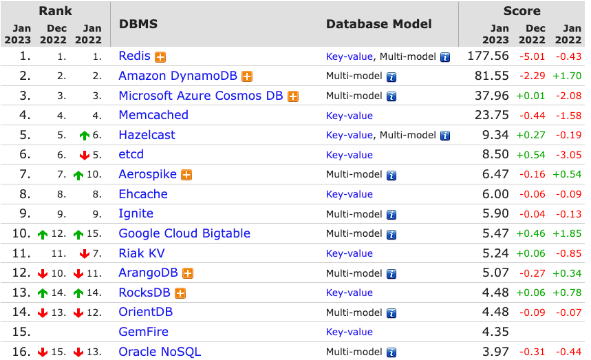
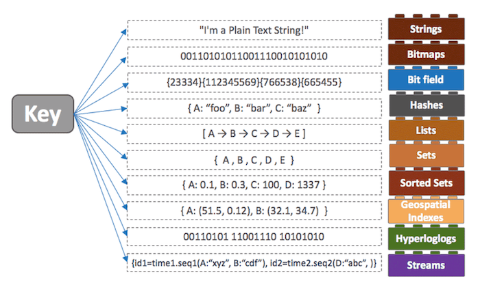
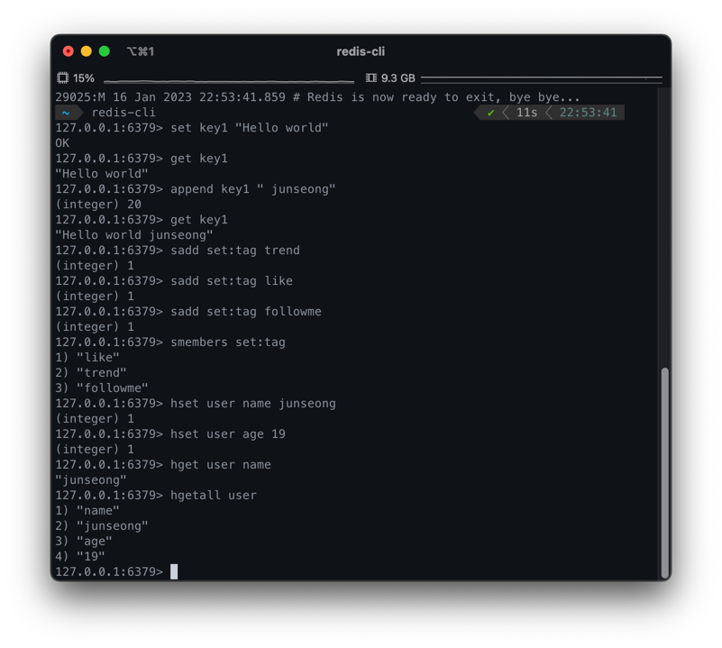

이번 스터디에서는 key-value 형식 DB로 많이 쓰이는 `Redis`가 무엇인지, `Redis`를 스프링에서 사용하는 방법 등을 자세히 알아본다.

## Redis란?

* Key, Value 구조의 비정형 데이터를 관리하는 비관계형 DBMS
* 보통 DB, 캐싱, 메시지 브로커로 이용된다.
* `인메모리 DB`이기 때문에 처리 속도가 빠르다.
* Key, Value 구조이기에 쿼리를 사용할 필요가 없다.

참고) 인메모리(In-Memory) DB란 컴퓨터의 주기억장치(메모리)에 모든 데이터를 저장하는 데이터베이스이다. 디스크 검색보다 자료 접근이 훨씬 빠른 것이 가장 큰 장점.
전형적인 디스크 방식은 저장된 데이터를 대상으로 쿼리를 수행하지만, 메모리 방식은 메모리 상에 색인을 넣어 모든 정보를 색인을 통해 빠르게 검색할 수 있다.


2023년 1월 db-engines.com 통계자료

### Redis에 데이터를 넣고 컴퓨터를 끄면 휘발되나요?

Redis는 인메모리 DB인데, 이 방식은 휘발성인 메모리에 저장하기 때문에 데이터 유실 위험이 있다. 이에 Redis는 영속성 보장을 위해 디스크에도 데이터를 저장한다.
서버가 내려가도 디스크에 저장된 데이터를 읽어서 메모리로 로딩하는 방식이다. 데이터를 디스크에 저장하는 방법은 아래 두 가지가 있다.

* RDB(Snapshotting) 방식 : 순간적으로 메모리에 있는 내용 전체를 디스크에 옮겨 담는 방식
* AOF(Append On File) 방식 : Redis의 모든 write/update 연산 자체를 모두 log 파일에 기록하는 형태

RDB 및 AOF 방식에 대한 비교, 더 자세한 자료는 [여기](./rdb_aof.md)를 참고하기 바란다.

### Redis의 자료구조?

Redis는 단순히 String 형태의 key-value 구조를 지원하는 DB인 것으로 알았겠지만, 사실은 `String`, `Lists`, `Sets`, `Hash` 등 더 다양한 데이터 구조를 지원한다. (컬렉션)

* `String` : 가장 일반적인 key-value 형태
* `Lists` : Array 형식의 데이터 구조
* `Sets` : String의 집합, 여러 값을 하나의 value에 넣을 수 있다.



### 싱글 스레드를 사용합니다...

Redis는 타 DBMS와 다르게 `Single Thread` 방식이다. 처리 시간이 긴 명령어가 들어오면 대기 시간이 길어지지만, 초당 10만 개 이상 처리할 만큼 빠르기에 큰 걱정 안해도 된다.
싱글 스레드이기에 Thread-safe하다는 장점도 있다.

## Redis terminal 사용법

* `brew install redis` : Mac에서 Redis 설치
* `redis-server` : Redis server 실행
* `redis-cli` : Redis client 접속



* `set`, `get` : 일반 String형 value 데이터
* `sadd`, `smembers` : set 자료구조 value 데이터
* `hset`, `hget` : map 자료구조 value 데이터
* `flushall` : Redis 모든 key 삭제

## Spring Redis 사용

의존성 추가
```
implementation 'org.springframework.boot:spring-boot-starter-data-redis'
```

환경변수 설정 (6379 포트는 기본값)
```yaml
spring:
  redis:
    host: localhost
    port: 6379
```

Redis 사용을 위한 기본 configuration
```java
@Configuration
public class RedisConfig {

    @Value("${spring.redis.host}")
    private String host;

    @Value("${spring.redis.port}")
    private int port;

    @Bean
    public RedisConnectionFactory redisConnectionFactory() {
        return new LettuceConnectionFactory(host, port);
    }
}
```

value 값은 Redis의 keyspace 값으로 사용된다. @Id 어노테이션이 붙은 필드가 Redis key가 된다. (최종 키는 `keyspace:id`이다.)
```java
@Getter
@RedisHash(value = "people", timeToLive = 30)
public class Person {

    @Id
    private String id;
    private String name;
    private Integer age;
    private LocalDateTime createdAt;

    public Person(String name, Integer age) {
        this.name = name;
        this.age = age;
        this.createdAt = LocalDateTime.now();
    }
}
```

CrudRepository를 상속받는 repository 인터페이스 선언
```java
public interface PersonRedisRepository extends CrudRepository<Person, String> {
}
```

```java
@SpringBootTest
public class RedisRepositoryTest {

    @Autowired
    private PersonRedisRepository repo;

    @Test
    void test() {
        Person person = new Person("Park", 20);

        // 저장
        repo.save(person);

        // `keyspace:id` 값을 가져옴
        repo.findById(person.getId());

        // Person Entity 의 @RedisHash 에 정의되어 있는 keyspace (people) 에 속한 키의 갯수를 구함
        repo.count();

        // 삭제
        repo.delete(person);
    }
}
```

* Spring Data Redis의 Redis Repository를 이용하면 간단히 Domain Entity를 Redis hash로 만들 수 있다.
* 이는 트랜잭션을 지원하지 않기 때문에, 트랜잭션을 사용하고 싶다면 `RedisTemplate`을 사용해야 한다.
* `RedisTemplate`을 사용하면 특정 Entity 뿐만 아니라 여러가지 원하는 타입을 넣을 수 있습니다.

```java
@Configuration
public class RedisConfig {

    @Value("${spring.redis.host}")
    private String host;

    @Value("${spring.redis.port}")
    private int port;

    @Bean
    public RedisConnectionFactory redisConnectionFactory() {
        return new LettuceConnectionFactory(host, port);
    }

    @Bean
    public RedisTemplate<?, ?> redisTemplate() {
        RedisTemplate<?, ?> redisTemplate = new RedisTemplate<>();
        redisTemplate.setConnectionFactory(redisConnectionFactory());
        return redisTemplate;
    }
}
```

```java
@SpringBootTest
public class RedisTemplateTest {

    @Autowired
    private RedisTemplate<String, String> redisTemplate;

    @Test
    void testStrings() {
        // given
        ValueOperations<String, String> valueOperations = redisTemplate.opsForValue();
        String key = "stringKey";

        // when
        valueOperations.set(key, "hello");

        // then
        String value = valueOperations.get(key);
        assertThat(value).isEqualTo("hello");
    }


    @Test
    void testSet() {
        // given
        SetOperations<String, String> setOperations = redisTemplate.opsForSet();
        String key = "setKey";

        // when
        setOperations.add(key, "h", "e", "l", "l", "o");

        // then
        Set<String> members = setOperations.members(key);
        Long size = setOperations.size(key);

        assertThat(members).containsOnly("h", "e", "l", "o");
        assertThat(size).isEqualTo(4);
    }

    @Test
    void testHash() {
        // given
        HashOperations<String, Object, Object> hashOperations = redisTemplate.opsForHash();
        String key = "hashKey";

        // when
        hashOperations.put(key, "hello", "world");

        // then
        Object value = hashOperations.get(key, "hello");
        assertThat(value).isEqualTo("world");

        Map<Object, Object> entries = hashOperations.entries(key);
        assertThat(entries.keySet()).containsExactly("hello");
        assertThat(entries.values()).containsExactly("world");

        Long size = hashOperations.size(key);
        assertThat(size).isEqualTo(entries.size());
    }
}
```

#### 더 알아볼 것들

* 분산 처리를 위한 `Redis Cluster`

#### references
* https://wildeveloperetrain.tistory.com/21#recentComments
* https://steady-coding.tistory.com/586
* https://bcp0109.tistory.com/328
* https://devlog-wjdrbs96.tistory.com/374
* https://db-engines.com/en/ranking/key-value+store