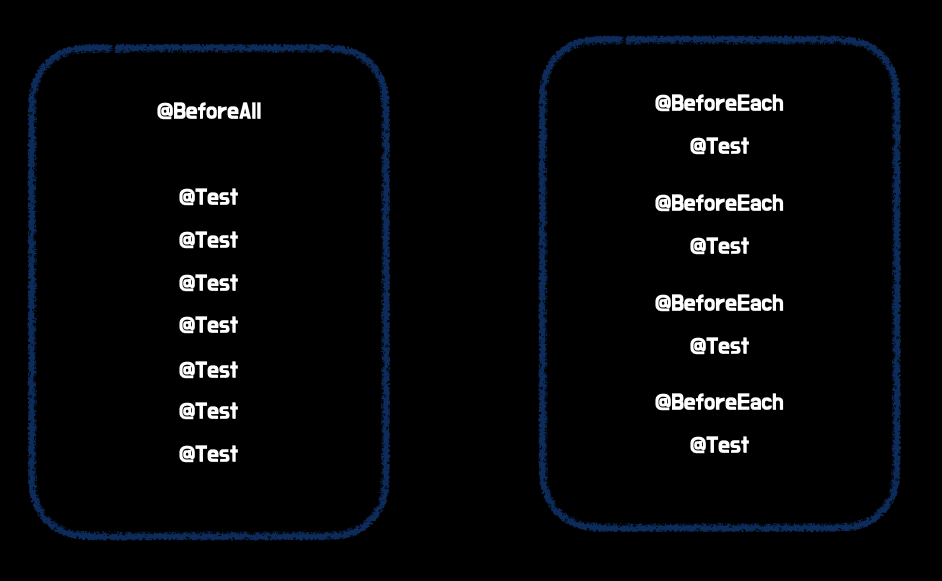

# JUnit이란?
<<<<<<< HEAD

- 현재 자바 개발자 90% 이상이 사용
- 자바8 이상부터 사용할 수 있는 단위테스트 프레임워크
- 스프링 부트 2.2 버전부터 기본으로 제공

# JUnit5란?

기존의 JUnit은 하나의 .jar 파일로 의존성을 불러와서 다른 라이브러리를 참조해서 사용하는 구조였는데
JUnit5부터는 자체적으로 모듈화가 되어있다. JUnit5는 **JUnit Platform + Jupiter + Vintage**와 같다.
아래 사진과 같이 JUnit Platform 모듈 위에 Jupiter와 Vintage가 올릴 수 있는 구조이다.


- JUnit5 버전은 2017년 10월에 공개
- **Platform** : JUnit으로 작성한 테스트 코드를 실행해주는 런처를 제공
- **Vintage** : JUnit3, 4를 지원하는 TestEngineAPI의 구현체
- **Jupiter** : JUnit5를 지원하는 TestEngineAPI의 구현체

Platform을 통해서 런처를 실행하고 JUnit3 또는 4로 작성한 코드의 경우 Vintage로,
JUnit5로 작성한 코드일 경우 Jupiter로 테스트가 실행된다.

# Annotation

테스트를 구성하고, 프레임워크를 상속하기 위해서 다음과 같은 어노테이션을 지한다.
따로 명시하지 않으면 대부분 **junit-jupiter-api** 모듈 안의 **org.junit.jupiter.api** 패키지안에 존재한다.

## Annotation - @Test

- 테스트 메서드라는 것을 나타내는 어노테이션
- JUnit4와 다르게 어느 속성도 사용하지 않음
  기존 JUnit4와는 다르게 Jupiter에서는 이미 해당 어노테이션들이 존재하기 때문에 속성을 사용할 필요가 없다.
=======
* 현재 자바 개발자 90% 이상이 사용
* 자바8 이상부터 사용할 수 있는 단위테스트 프레임워크
* 스프링 부트 2.2 버전부터 기본으로 제공


# JUnit5란?
기존의 JUnit은 하나의 .jar 파일로 의존성을 불러와서 다른 라이브러리를 참조해서 사용하는 구조였는데 
JUnit5부터는 자체적으로 모듈화가 되어있다. JUnit5는 **JUnit Platform + Jupiter + Vintage**와 같다. 
아래 사진과 같이 JUnit Platform 모듈 위에 Jupiter와 Vintage가 올릴 수 있는 구조이다.


* JUnit5 버전은 2017년 10월에 공개
* **Platform** : JUnit으로 작성한 테스트 코드를 실행해주는 런처를 제공
* **Vintage** : JUnit3, 4를 지원하는 TestEngineAPI의 구현체
* **Jupiter** : JUnit5를 지원하는 TestEngineAPI의 구현체


Platform을 통해서 런처를 실행하고 JUnit3 또는 4로 작성한 코드의 경우 Vintage로, 
JUnit5로 작성한 코드일 경우 Jupiter로 테스트가 실행된다.


# Annotation
테스트를 구성하고, 프레임워크를 상속하기 위해서 다음과 같은 어노테이션을 지한다. 
따로 명시하지 않으면 대부분 **junit-jupiter-api** 모듈 안의 **org.junit.jupiter.api** 패키지안에 존재한다.


## Annotation - @Test
* 테스트 메서드라는 것을 나타내는 어노테이션
* JUnit4와 다르게 어느 속성도 사용하지 않음
기존 JUnit4와는 다르게 Jupiter에서는 이미 해당 어노테이션들이 존재하기 때문에 속성을 사용할 필요가 없다.
>>>>>>> df5116038ef582d265dda2de8d2f3fdc47d42d33

```java
// JUnit4
@Test(expected = Exception.class)
void create() throws Exception {}

// JUnit5
@Test
void create() {}
```

## Annotation - 생명주기(Life Cycle)
<<<<<<< HEAD

- **@BeforeEach** : 해당 클래스에 위치한 모든 테스트 메서드 실행 전에 실행되는 메서드
- **@AfterEach** : 해당 클래스에 위치한 모든 테스트 메서드 실행 후에 실행되는 메서드

- **@BeforeAll** : 해당 클래스에 위치한 모든 테스트 메서드 실행 전에 딱 한 번 실행되는 메서드
- **@AfterAll** : 해당 클래스에 위치한 모든 테스트 메서드 실행 후에 딱 한 번 실행되는 메서드

@~Each와 @~All 어노테이션은 테스트 조건을 **setup**하는 방식에 있어서 차이가 있다.
=======
* **@BeforeEach** : 해당 클래스에 위치한 모든 테스트 메서드 실행 전에 실행되는 메서드
* **@AfterEach** : 해당 클래스에 위치한 모든 테스트 메서드 실행 후에 실행되는 메서드


* **@BeforeAll** : 해당 클래스에 위치한 모든 테스트 메서드 실행 전에 딱 한 번 실행되는 메서드
* **@AfterAll** : 해당 클래스에 위치한 모든 테스트 메서드 실행 후에 딱 한 번 실행되는 메서드

@~Each와 @~All 어노테이션은 테스트 조건을 **setup**하는 방식에 있어서 차이가 있다. 
>>>>>>> df5116038ef582d265dda2de8d2f3fdc47d42d33
@~Each 어노테이션은 모든 테스트 메서드가 실행하기 전에 테스트 조건을 setup 하므로 비효율적일 수 있다.



## Annotation - @Disabled
<<<<<<< HEAD

- 테스트를 제외하고 싶은 메서드를 지정
- JUnit4의 @Ignore과 비슷함
=======
* 테스트를 제외하고 싶은 메서드를 지정
* JUnit4의 @Ignore과 비슷함
>>>>>>> df5116038ef582d265dda2de8d2f3fdc47d42d33

```java
@Test
@Disabled("로그인 에러가 완전히 수정될 때까지 테스트 보류")
void create() {}
```

## Annotation - @Display
<<<<<<< HEAD

- 어떤 테스트인지 상세하게 기술할 수 있도록 해줌
- 공백, 이모지, 특수문자 등을 모두 지원
=======
* 어떤 테스트인지 상세하게 기술할 수 있도록 해줌
* 공백, 이모지, 특수문자 등을 모두 지원
>>>>>>> df5116038ef582d265dda2de8d2f3fdc47d42d33

```java
@Test
@Disabled("테스트 이름 💣")
void create() {}
```

## Annotation - @RepeatedTest
<<<<<<< HEAD

- 특정 테스트를 반복하고 싶을 때 사용함
- 반복 횟수와 반복 테스트 이름 설정 가능
- 주로 성능 테스트를 할 때 사용함
- @RepeatedTest 어노테이션 자체에서 지원하는 place holder를 사용하면 더욱 상세한 테스트가 가능함
=======
* 특정 테스트를 반복하고 싶을 때 사용함
* 반복 횟수와 반복 테스트 이름 설정 가능
* 주로 성능 테스트를 할 때 사용함
* @RepeatedTest 어노테이션 자체에서 지원하는 place holder를 사용하면 더욱 상세한 테스트가 가능함
>>>>>>> df5116038ef582d265dda2de8d2f3fdc47d42d33

```java
@Test
@DisplayName("생성")
@RepeatedTest(value = 1000, name = "{displayName} 중 {currentRepetition} of {totalRepetitions}")
void create() {}
```

## Annotation - @ParameterizedTest
<<<<<<< HEAD

- 테스트 메서드에 각각 다른 매개변수를 대입해가며 반복 실행할 때 사용함
- 반복문을 사용하는 것 보다 가독성이 향상됨

=======
* 테스트 메서드에 각각 다른 매개변수를 대입해가며 반복 실행할 때 사용함
* 반복문을 사용하는 것 보다 가독성이 향상됨
>>>>>>> df5116038ef582d265dda2de8d2f3fdc47d42d33
```java
@Test
@ParameterizedTest
@ValueSource(ints = {1, 2, 3, 4, 5, 6, 7, 8})
void print(int input) {
    System.out.println(input);
}
```

## Annotation - @Nested
<<<<<<< HEAD

- 테스트 클래스 안에서 내부 클래스를 정의해 테스트를 계층화 할 때 사용
- 내부 클래스는 부모 클래스의 멤버 필드에 접근 가능
- Before/After와 같은 테스트 생명주기에 관계된 메서드들도 게층에 맞춰 동작
  **@Transaction** 어노테이션의 속성인 **propagation**의 **nested**와도 비슷함

# Assertions

- 테스트 케이스의 수행 결과를 판별하는 메서드
- 모든 JUnit Jupiter Assertions는 static 메서드

# Assertions - assertAll

- 매개변수로 받는 모든 테스트코드를 한 번에 실행
- 오류가 나도 끝까지 실행한 뒤 오류를 한 번에 모아서 출력 가능
=======
* 테스트 클래스 안에서 내부 클래스를 정의해 테스트를 계층화 할 때 사용
* 내부 클래스는 부모 클래스의 멤버 필드에 접근 가능
* Before/After와 같은 테스트 생명주기에 관계된 메서드들도 게층에 맞춰 동작
**@Transaction** 어노테이션의 속성인 **propagation**의 **nested**와도 비슷함


# Assertions
* 테스트 케이스의 수행 결과를 판별하는 메서드
* 모든 JUnit Jupiter Assertions는 static 메서드

# Assertions - assertAll
* 매개변수로 받는 모든 테스트코드를 한 번에 실행
* 오류가 나도 끝까지 실행한 뒤 오류를 한 번에 모아서 출력 가능
>>>>>>> df5116038ef582d265dda2de8d2f3fdc47d42d33

```java
@Test
@ParameterizedTest
@ValueSource(ints = {10, 20})
void print(int a, int b) {
    assertEquals(a, b);
    assertEquals(10, a + b);
}
```

<<<<<<< HEAD
위의 코드는 첫번째 assertEquals에서 실패할 경우 다음 테스트가 진행되지 않는다.
=======
위의 코드는 첫번째 assertEquals에서 실패할 경우 다음 테스트가 진행되지 않는다. 
>>>>>>> df5116038ef582d265dda2de8d2f3fdc47d42d33
하지만 아래와 같이 assertAll을 감싸면 테스트가 도중에 실패해도 모든 테스트를 끝마친 후 결과를 한 번에 반환한다.

```java
@Test
@ParameterizedTest
@ValueSource(ints = {10, 20})
void print(int a, int b) {
    assertAll(
        () -> assertEquals(a, b),
        () -> assertEquals(10, a + b)
    );
}
```

# Assertions - assertThrows(expectedType, executable)
<<<<<<< HEAD

- 예외 발생을 확인하는 테스트
- executable의 로직이 실행하는 도중 expectedType의 에러를 발생시키는지 확인

=======
* 예외 발생을 확인하는 테스트
* executable의 로직이 실행하는 도중 expectedType의 에러를 발생시키는지 확인
>>>>>>> df5116038ef582d265dda2de8d2f3fdc47d42d33
```java

@Test
@ParameterizedTest
void exception() {
Exception e = assertThrows(Exception.class,() -> new Test(-10));
assertDoesNotThrow(() -> System.out.println("can't exec test"));
}

```

# Assertions - assertTimeout(duration, executable)
<<<<<<< HEAD

- 특정 시간 안에 실행이 완료되는지 확인
- **Duration** : 원하는 시간
- **Executable** : 테스트 할 로직
=======
* 특정 시간 안에 실행이 완료되는지 확인
* **Duration** : 원하는 시간
* **Executable** : 테스트 할 로직
>>>>>>> df5116038ef582d265dda2de8d2f3fdc47d42d33

```java
@Test
@ParameterizedTest
void exception() {
    assertTimeout(Duration.ofMillis(1000), () -> Thread.sleep(100));
}
```

# Assumption
<<<<<<< HEAD

- 전제문이 true라면 실행, false라면 종료
- assumeTrue : false 일 때 이후 테스트 전체가 실행되지 않음
- assumingThat : 파라미터로 전달된 코드블럭만 실행되지 않음

=======
* 전제문이 true라면 실행, false라면 종료
* assumeTrue : false 일 때 이후 테스트 전체가 실행되지 않음
* assumingThat : 파라미터로 전달된 코드블럭만 실행되지 않음
>>>>>>> df5116038ef582d265dda2de8d2f3fdc47d42d33
```java
@Test
@ParameterizedTest
void exception(int input) {
    assumeTrue(input == 10, () -> "입력값이 10이 아니므로 테스트를 종료합니다.");
    assertTimeout(Duration.ofMillis(1000), () -> Thread.sleep(100));
}
```
<<<<<<< HEAD

=======
>>>>>>> df5116038ef582d265dda2de8d2f3fdc47d42d33
```java
public class Ref {
    final String [10분 테코톡] 🌊 바다의 JUnit5 사용법 = "https://www.youtube.com/watch?v=EwI3E9Natcw";
}
<<<<<<< HEAD
```
=======
```
>>>>>>> df5116038ef582d265dda2de8d2f3fdc47d42d33
