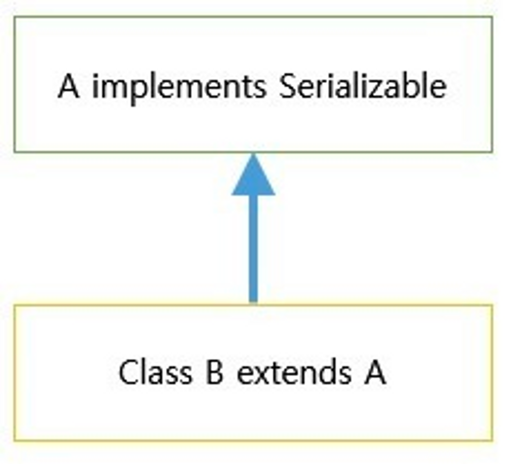
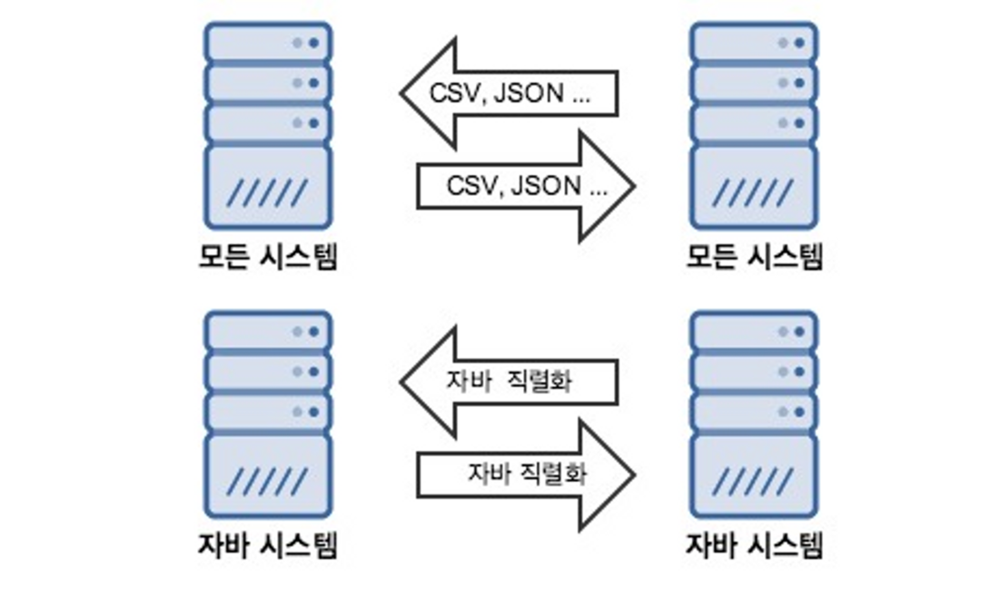

이번 스터디에서는 한번쯤 들어보지만 정확하게는 알아보지 않았던 `직렬화`에 대해 알아보고자 한다. 가볍게 들어주면 좋겠다.

## 자바 직렬화

`자바 직렬화`란 자바 시스템 내부에서 사용되는 객체 또는 데이터를 외부의 자바 시스템에서도 사용할 수 있도록 바이트(byte) 형태로 데이터 변환하는 기술 및 변환된 데이터를 다시 객체로 변환하는 기술(역직렬화)을 아울러서 칭한다.

시스템적으로 **JVM의 Runtime Data Area(Heap 또는 스택 영역)에 상주하고 있는 객체 데이터를 바이트 형태로 변환하는 기술**과 **직렬화된 바이트 형태의 데이터를 객체로 변환해서 JVM으로 상주시키는 형태**를 말하기도 한다.

### Serializable

```java
public interface Serializable() {
}
```

우리가 만든 클래스가 파일에 읽거나 쓸 수 있도록 할 때, 다른 서버로 보내고 받을 수 있도록 할 때 반드시 이 인터페이스(Serializable)를 구현해야 한다.

- 생성한 객체를 파일로 저장할 때
- 저장한 객체를 읽을 때
- 다른 서버에서 생성한 객체를 받을 때

한마디로, Serializable 인터페이스를 구현하면 JVM에서 해당 객체는 저장하거나 다른 서버로 전송할 수 있게 해준다.

### Serializable이 없는 경우의 직렬화

보통의 경우는 직렬화가 불가능하다.

하지만 `Serializable`을 `implement`한 클래스를 상속받은 경우에는 가능하다.



### transient란?

보통 직렬화를 적용하면, 클래스의 멤버변수 전부 직렬화 대상에 해당된다.

하지만 보안 상의 문제나 기타 이유로 멤버 변수의 일부를 제외하고 싶다면 `transient`를 사용하면 된다.

```java
public class User implements Serializable {
    private String id;
    private transient String password;
    private String email;

    //....
}
```

### 다른 객체를 멤버변수로 가지고 있다면

int, long, String 등 기본 자료형 뿐만 아니라 **다른 객체를 멤버변수로 사용하는 경우**가 많다.

```java
public class User implements Serializable {
    private String id;
    private transient String password;
    private String email;

    ItemInfo itemInfo;
    Calendar regDate;

    //....
}
```

위 코드에서 `ItemInfo` , `Calendar` 클래스들 중 `Serializable` 인터페이스를 구현한 클래스가 하나라도 없다면 `java.io.InvalidClassException` 예외가 발생한다.

다시 말해서, 멤버 변수의 클래스 중 `Serializable`을 구현하지 않은 클래스가 있을 때 직렬화를 할 수 없다.

### serialVersionUID

직렬화하면 내부에서 자동으로 `SerialVersionUID`라는 고유의 번호를 생성하여 클래스의 버전을 관리한다.

이 `UID`는 직렬화와 역직렬화할 때 중요한 역할을 한다.

이 값이 맞는지 확인 후 처리하기 때문에, `SerialVersionUID`가 맞지 않는다면 `java.io.InvalidClassException` 예외가 발생하게 된다.

- `serialVersionUID`는 필수 값은 아니다.
- 호환 가능한 클래스는 `serialVersionUID` 값이 고정되어 있다.
- `serialVersionUID`가 선언되어 있지 않으면 **클래스의 기본 해쉬값**을 사용하게 된다.

특별한 문제가 없으면 Java 직렬화 버전 serialVersionUID 값은 개발자가 직접 관리해줘야 한다.

---

## 자바에서 CSV, JSON 말고 굳이 직렬화를 사용해야 하는 이유?

결론을 이야기하자면 정답은 없다.

목적에 따라 적절히 써야 한다. 직렬화의 장단점은 무엇일까?

### 자바 직렬화의 장점

자바 직렬화는 자바 시스템 개발에 최적화되어있다. 복잡한 데이터 구조의 객체라도 직렬화 기본 조건만 지키면 큰 작업 없이 바로 직렬화가 가능하다.

특히 데이터 타입이 자동으로 맞춰지기 때문에 관련 부분에 큰 신경을 쓰지 않아도 된다. 그렇게 역직렬화되면 기존 객체처럼 바로 사용 가능하다.



### 자바 직렬화의 단점 (유의할 점?)

특별한 문제가 없으면 자바 직렬화 버전(`serialVersionUID`) 값은 개발자가 직접 관리해야 한다.

역직렬화 대상 클래스의 **멤버 변수 타입 변경**을 지양해야 한다. 자바 역직렬화는 타입에 엄격하다. (나중에라도 타입이 변경되면 예외를 다 신경써야 한다)

외부(DB, 캐시 서버 등)에 **장기간 저장될 정보**는 자바 직렬화 사용을 지양해야 한다.

(역직렬화 대상 클래스가 언제 변경될지 모르는 환경에 긴 시간동안 외부에 존재한다는 것 → 언제 예외가 발생할지 모르는 지뢰 시스템)

개발자가 **직접 컨트롤할 수 없는 클래스의 객체**에 대해서는 직렬화를 지양해야 한다. (보통 프레임워크, 라이브러리 등에서 제공하는 클래스의 객체)

그런 객체는 보통 `serialVersionUID`를 가지고 있어서 편의상 직렬화시켜 바로 DB에 저장하는데, 이 부분에서 문제가 발생한다.

1. 프레임워크 또는 라이브러리가 버전업을 하면서 `serialVersionUID`를 변경
2. 테스트할 때는 멀쩡하다가 운영에 반영

이와 관련된 예시는 스프링 시큐리티의 `SecurityContextImpl` 클래스가 있다.

`serialVersionUID` 값이 스프링 시큐리티의 버전 값이기 때문에 버전이 변경될 때마다 신경쓰인다.

## 결론

* 자주 변경되는 클래스의 객체에는 자바 직렬화를 사용하지 않는 것이 좋다. (변경에 취약하기 때문에 생각지도 못한 예외가 발생할 가능성이 높다.)
* 특히 **역직렬화가 되지 않을 때**와 같은 예외처리는 기본적으로 해두는 것을 추천한다.

#### References

* https://devlog-wjdrbs96.tistory.com/268
* https://flowarc.tistory.com/entry/Java-%EA%B0%9D%EC%B2%B4-%EC%A7%81%EB%A0%AC%ED%99%94Serialization-%EC%99%80-%EC%97%AD%EC%A7%81%EB%A0%AC%ED%99%94Deserialization
* https://velog.io/@sa1341/Java-%EC%A7%81%EB%A0%AC%ED%99%94%EB%A5%BC-%ED%95%98%EB%8A%94-%EC%9D%B4%EC%9C%A0%EA%B0%80-%EB%AC%B4%EC%97%87%EC%9D%BC%EA%B9%8C
* https://techblog.woowahan.com/2550/
* https://techblog.woowahan.com/2551/