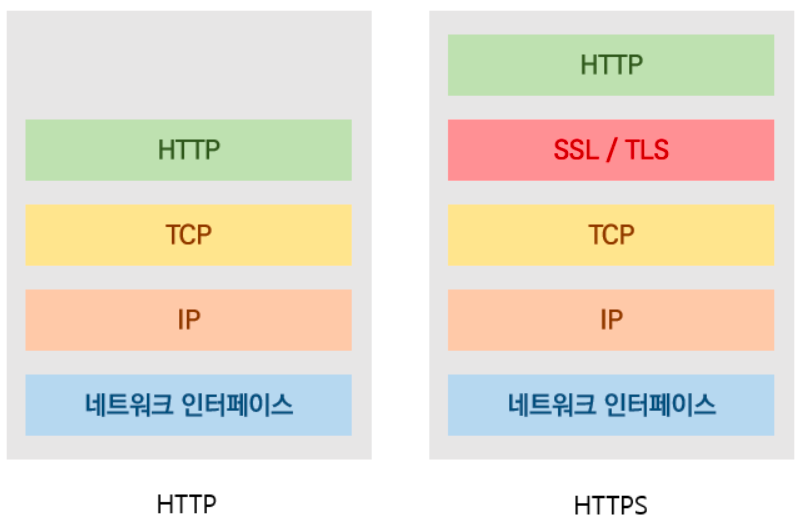
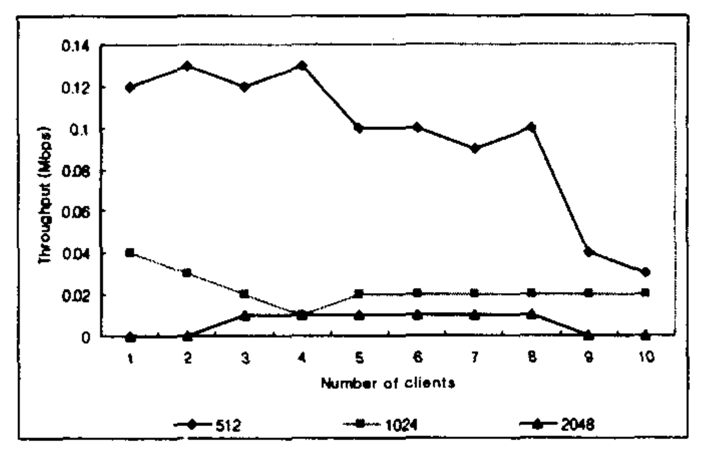

이번 스터디에서는 `HTTP` 프로토콜로 통신할 때 보안 사항을 준수하기 위해(웹 통신 시 기본적인 보안을 위해) 적용해야 하는 `HTTPS`(`SSL`, `TLS` 프로토콜)에 대해서 자세히 알아본다.

## 선행 지식

* 대칭키
* 비대칭키 (공개키, 비밀키)
* CA (Certificate Authority)
* 핸드셰이크

## HTTP 통신의 허점

우리가 기본적인 HTTP 프로토콜을 사용하는 웹서버(웹앱서버)를 띄워 로그인 API를 호출할 때, 아이디와 비밀번호를 서버로 보내면 입력한 텍스트는 누구든 알아볼 수 있는 평문으로 보내진다. 만약 누군가가 중간에서 이 정보를 탈취한다면 유저의 아이디와 비밀번호를 고스란히 알게 된다.

이러한 치명적인 보안적 허점을 해결하기 위해 인증서를 발급받고, 그 인증서를 기반으로 데이터를 인코딩해서 주고받는다. 이는 다른 누군가가 탈취하더라도 알아볼 수 없게 된다. 이 방법이 `HTTPS`이다.

## HTTPS란?

기존의 `HTTP`는 `TCP/IP` 위의 애플리케이션 계층에서 사용되는 프로토콜이다. `HTTPS`는 `TCP/IP` 계층 위에 `SSL(TLS)`를 얹어 보안을 강화한 프로토콜 방식이다. 이를 통해 모든 HTTP 요청과 응답은 암호화된다.

만일 `HTTPS`에서 대칭키를 사용할 경우 최초 한 번은 서버에서 클라이언트로 암호화에 사용할 키를 전달해야 하는데, 그 과정에서 암호화 키를 누군가 탈취한다면 누군가 암호화/복호화 가능한 키를 가지고 있기 때문에 암호화 통신을 하더라도 무용지물이 된다. (누군가 데이터를 복호화해서 정보를 다 해석할 수 있다.)

비대칭키를 사용할 경우 서버는 개인키/공개키를 둘 다 가지고 있고, 클라이언트에서 요청할 때 공개키만 준다. 이 공개키로 암호화한 데이터는 서버만 가지고 있는 '개인키'로만 복호화 가능하다. 그리하여 누군가 공개키를 탈취하고 데이터를 탈취하더라도 데이터를 복호화할 수 없게 된다.

하지만 비대칭키 암호화 알고리즘은 키의 길이가 적어도 1024비트 이상이며, 대부분의 연산이 정수론에 바탕을 둔 소수 구하기, 2의 거듭제곱 연산이기에 암호화/복호화 속도가 매우 느리다. (서버의 부하를 일으킬 수 있다. 실제 논문 실험 결과 하나의 요청 처리에도 수 초에서 수십 초가 소요된다.)

*참고) Mbps = Mega Bits Per Second (1초에 몇 메가 비트)*

`HTTPS`는 각각의 단점을 보완하기 위해 대칭키/비대칭키 방식을 혼합하여 사용한다. 최초 한 번 서버가 공개키/개인키를 가지고 있다가 클라이언트가 요청 시 공개키를 전달해준다. 클라이언트는 실제 데이터 전달에 사용할 대칭키를 공개키로 암호화하여 서버에 전달한다. 서버는 개인키를 사용해 대칭키를 복호화하고 그 후 대칭키로 실제 통신이 이루어진다. (이러한 방식을 사용하면 최초 핸드셰이킹 시에만 비대칭키 알고리즘을 사용하니 속도 저하의 문제도 해결되고, 대칭키 전달 시 대칭키를 비대칭키로 암호화하니 중간에 대칭키가 탈취되어도 누군가가 복호화할 수 없는(사용할 수 없는) 키가 되기에 보안적으로도 안전하다.)

이러한 대칭키는 HTTPS 통신 과정에서 `세션키`로 불린다.

## SSL 및 TLS

앞서 SSL은 TCP/IP 계층의 위에서 동작하는 프로토콜, 인터넷을 통해 전송되는 데이터의 인증, 암호화, 복호화를 위한 프로토콜(계층)이라는 것을 간접적으로 알아봤다.

사실 SSL은 TLS(Transport Layer Security)라는 또 다른 프로토콜의 이전 버전이다. 그래서 TLS 암호화/TLS Handshake라고 부르는 게 바람직하지만, SSL이 더 잘 알려져있기에 그냥 SSL로 부르거나 TLS/SSL로 명명하기도 한다. 필자는 SSL이라고 명시하겠다.

## TCP 3-way Handshake 과정

1. 클라이언트는 서버에게 접속 요청을 위한 메시지(SYN)를 보낸다. 18503218같이 의미없는 난수를 같이 보낸다. (SEQ넘버)
2. 서버는 클라이언트에게 SYN 요청을 받은 다음, 연결을 수락(ACK)한다. 서버에서도 85291953같이 난수를 보낸다. (ACK넘버)
3. 클라이언트는 서버에 접속 수락 확인(SYN)을 보낸다. 이때 서버측에서 넘겨준 ACK넘버에 1을 더해 같이 보내준다. TCP 연결이 성립, 서버는 ESTABLISHED 상태가 된다.

## SSL Handshake 과정

HTTPS는 TCP 위에 SSL 계층이 있는 구조이므로 TCP 3-way Handshake 과정을 거친 후 SSL Handshake 과정에 들어간다.

1. Client Hello
2. Server Hello
3. 인증서 확인
4. Premaster Secret
5. Premaster Secret 복호화
6. SSL Handshake 종료 + HTTPS 통신 시작

#### references
* https://inuplace.tistory.com/1086
* https://kimmeh1.tistory.com/499
* https://koreascience.kr/article/CFKO200411922747912.pdf
* https://velog.io/@alscjf6315/HTTPS-%EC%9D%98-%EB%8F%99%EC%9E%91%EC%9B%90%EB%A6%AC
* https://bpsecblog.wordpress.com/2016/12/05/amalmot_6/
