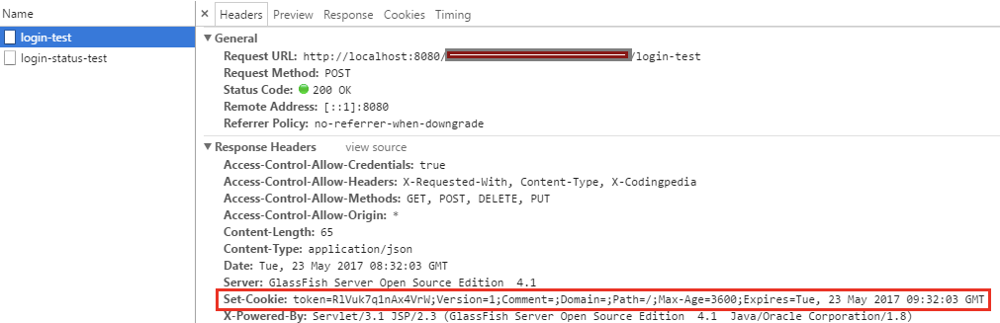
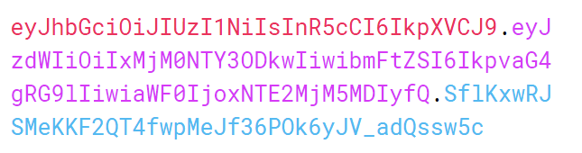

이번 스터디에서는 웹앱서버 개발 시 필수적인 개념인 쿠키, 세션, 그리고 토큰에 대해 아주 자세히 알아보고자 한다. 이것들은 왜 생겨났고, 또 인증 방식이 뭐 그렇게 많은 걸까.

## HTTP 특성

`HTTP`는 `인터넷 상에서 데이터를 주고 받기 위한 서버/클라이언트 모델을 따르는 프로토콜`이다.<br>
클라이언트가 서버에게 요청을 보내면, 서버는 응답을 보냄으로써 데이터를 교환한다.

`HTTP`는 **비연결성** 및 **무상태성**이라는 특징을 가지고 있다.<br>
`HTTP`는 요청 처리 후 연결을 끊어버리기 때문에, 클라이언트의 상태 정보 및 현재 통신 상태가 남아있지 않다.<br>

#### 비연결성의 장단점
이 **비연결성**의 장점은 서버의 **자원 낭비를 줄일 수 있다**는 것이다.<br>
만약 다수의 클라이언트와 연결을 유지한다면 자원 낭비가 심해질 것이다.<br>

허나 **비연결성**은 **클라이언트를 식별할 수 없다**는 단점 또한 존재한다.<br>
로그인을 하더라도 다음 요청에서 해당 클라이언트를 기억하지 못해서, 무한 로그인을 해야 할 것이다.<br>
심지어 브라우저 새로고침을 누를 때마다 로그인을 해야한다.<br>

그렇기 때문에 회원 기능이 있는 웹서버는 사용자와 관련한 상태를 기억하기 위한 방법이 필요했다. 
이러한 방법을 아래 쿠키, 세션, 토큰 파트에 나눠 설명했다.

## 쿠키 (Cookie)

`쿠키`란 클라이언트가 어떠한 웹사이트를 방문할 경우, 그 사이트가 사용되고 있는 서버를 통해 **클라이언트의 브라우저에 설치되는 작은 기록 파일**을 일컫는다. (쿠키는 `Key-Value` 형식의 문자열이다.)

#### 쿠키 동작 원리
* 쿠키는 공개 가능한 정보를 사용자의 브라우저에 저장시킨다.
* 서버는 클라이언트의 요청에 응답할 때, 클라 측에 저장하고 싶은 정보를 응답 헤더 `set-cookie`에 담는다.
* 이후 클라이언트가 요청할 때마다 쿠키를 요청 헤더 `cookie`에 담아 보낸다.
* 서버는 쿠키에 담긴 정보를 바탕으로 해당 클라이언트가 누군지 식별할 수 있다.

#### 쿠키의 허점
* 무엇보다 보안에 취약하다. (요청 시 쿠키의 값을 그대로 보내어, 유출 및 조작당할 위험이 존재한다.)
* 용량 제한이 있어, 많은 정보를 담을 수 없다.
* 웹 브라우저마다 쿠키에 대한 지원 형태가 다르기에, 브라우저 간 공유가 불가능하다.
* 쿠키의 사이즈가 커질수록 네트워크에 부하가 심해진다.



## 세션 (Session)

세션은 비밀번호 등 클라이언트의 인증 정보를 웹브라우저 측 `쿠키`가 아닌 **서버 측에 저장하고 관리**한다.

서버는 클라이언트의 로그인 요청에 대한 응답을 작성할 때, 인증 정보는 서버에 저장하고, 클라이언트 식별자인 `session id`를 쿠키에 담는다. 이후 클라이언트는 요청을 보낼 때마다 `session id`쿠키를 함께 보낸다. 그리하면 서버는 `session id`의 유효성을 판별해 클라이언트를 식별한다. <br>
참고로, `톰캣 컨테이너`에서 세션을 유지하기 위해 발급하는 키를 `JSESSIONID`라고 한다.

#### 세션 기반 인증의 장점
* 서버가 클라이언트의 웹 브라우저에 의존하지 않아도 된다.
* 쿠키를 포함한 요청이 외부에 노출되어도 세션 ID 자체는 유의미한 개인 정보를 담지 않는다.
* 각 사용자마다 고유한 세션 ID가 발급되기 때문에, 요청이 들어올 때마다 회원 정보를 확인(로그인)할 필요 없다.

#### 세션 기반 인증의 단점
* 해커가 세션 ID를 중간에 탈취하여 클라이언트인 척 위장할 수 있다.
* 서버에서 세션 저장소를 사용하기 때문에, 요청이 많아지면 서버에 부하가 생긴다.

## 토큰 (Token)

#### 토큰 기반 인증 방식 JWT

`JWT(JSON Web Token)`는 인증에 필요한 정보들을 암호화시킨 토큰이다. 
JWT 기반 인증은 쿠키/세션 방식과 유사하게 `JWT 토큰(Access Token)`을 `HTTP 헤더`에 실어 서버가 클라를 식별한다.



JWT의 구조는 위 사진과 같이 세가지 문자열의 조합이다. 실제 디코딩된 JWT는 `Header`, `Payload`, `Signature`로 이루어져 있다.

#### Header

* `Header`는 `alg`와 `typ`을 갖고 있다.
* `alg`는 정보를 암호화할 해싱 알고리즘을, `typ`는 토큰의 타입을 지정한다.

```json
{
	"alg": "HS256",
	"typ": "JWT"
}
```

#### Payload

* `Payload`는 실제로 토큰에 담을 정보를 지니고 있다.
* 주로 `클라이언트 고유 ID`, `유효 기간` 등이 포함된다.
* `Key-Value` 형식으로 이루어진 한 쌍의 정보를 `Claim`이라고 한다.

```json
{
	"sub": "1234567890",
	"name": "John Doe",
	"iat": 1516230922
}
```

#### Signature

* `Signature`는 인코딩된 `Header`와 `Payload`를 더한 뒤, 비밀키로 해싱하여 생성한다.
* `Header` 및 `Payload`는 단순 인코딩된 값이기 때문에 해커가 복호화하고 조작할 수 있지만, `Signature`는 서버 측에서 관리하는 비밀키가 유출되지 않는 이상 복호화할 수 없다.
* 따라서 `Signature`는 토큰의 **위변조 여부를 확인**하는 데 사용된다.

```java
HMACSHA256(
	base64UrlEncode(header) + "." +
	base64UrlEncode(payload),
	secret_key
)
```

#### 토큰 인증 과정

1. 클라이언트 로그인 요청이 들어오면, 서버는 검증 후 클라이언트 고유 ID등의 정보를 `Payload`에 담는다.
2. 암호화할 비밀키를 사용해 `Access Token(JWT)`을 발급한다.
3. 클라이언트는 전달받은 토큰을 저장해두고, 서버에 요청할 때마다 토큰을 요청 헤더 `Authorization`에 포함시켜 함께 전달한다.
4. 서버는 토큰의 `Signature` 을 비밀키로 복호화한 다음, `위변조 여부` 및 `유효 기간` 등을 확인한다.
5. 유효한 토큰이라면 요청에 응답한다.

#### 토큰의 장점

* `Header`와 `Payload`를 가지고 `Signature`를 생성하므로 데이터 위변조를 막을 수 있다. 
* 인증 정보에 대한 별도의 저장소가 필요 없다. 
* JWT는 `토는 서명` 등큰에 대한 기본 정보`와 `전달할 정보` 및 `토큰이 검증됐음을 증명하 필요한 모든 정보를 자체적으로 지니고 있다. 
* 클라이언트의 인증 정보를 저장하는 세션과 다르게, 서버는 무상태(Stateless)가 된다. 
* 토큰 기반으로 다른 로그인 시스템에 `접근` 및 `권한 공유`가 가능하다. (`OAuth`)
* 모바일 어플리케이션 환경에서도 잘 동작한다.

#### 토큰의 단점

* `쿠키`, `세션`과 다르게 JWT는 토큰의 길이가 길어, 인증 요청이 많을수록 네트워크 부하가 심해진다.
* `Payload` 자체는 암호화되지 않기 때문에 유저의 중요한 정보는 담을 수 없다. (패스워드 등)
* 토큰을 탈취당하면 대처하기 어렵다. 토큰은 한 번 발급되면 유효기간이 만료될 때까지 계속 사용이 가능하다. 
* 특정 사용자의 접속을 강제로 만료하기 어렵다. (쿠키/세션 기반 인증은 서버 단에서 쉽게 삭제할 수 있지만 토큰은 그게 안됨)

## 토큰 단점을 보완하는 전략들

#### 짧은 만료 기한 설정

* 토큰의 만료 기한을 짧게 설정해서 탈취되더라도 빠르게 만료시키는 방법이다.
* 하지만 이는 토큰이 만료되면 사용자가 다시 로그인해야 한다는 뜻이기에 사용자 입장에서 번거로운 방법이다.

#### Sliding Session

* 서비스를 지속적으로 이용하는 클라이언트에게 **자동으로 토큰 만료 기한을 늘려주는 방법**이다. (만약 글을 작성하다가 토큰이 만료된다면 새로운 토큰을 발급해주는 것이다.)
* 사용자가 로그인을 자주 할 필요가 없다.

#### Refresh Token

* 클라이언트가 로그인할 때 `Access Token` 및 `Refresh Token`을 함께 발급해주는 방법이다. (`Refresh Token`은 `Access Token`보다 만료 기한이 긴 토큰을 칭하는 것)
* 클라이언트가 요청을 보냈는데 `Access Token`이 만료되었을 때, `Refresh Token`을 이용하여 `Access Token`의 재발급을 요청한다.
* 이때 서버는 `Refresh Token`을 복호화 후 유효하면 `Access Token`을 발급한다. (만약 `Refresh Token`도 만료된 경우라면 사용자에게 로그인을 요구한다.)

이 전략을 사용하면 Access Token의 만료 기한을 짧게 설정하여 위의 `짧은 만료 기한 설정` 전략처럼 탈취되더라도 빠르게 만료될 수 있다. 또한 짧은 만료 기한에도 불구하고 자주 로그인을 할 필요가 없어진다.

이 방식의 단점은 `Refresh Token`이 공격자에게 탈취당할 경우, 해당 공격자가 토큰을 계속 refresh 하며 사실상 기한 제한 없이 로그인을 유지할 수 있다.

#### Refresh Token + Session Storage

* refresh token의 `payload`를 캐시 서버(또는 세션 스토리지)에 저장한 후 refresh 요청시 서버측에 저장된 refresh token의 `payload`와 일치여부를 검사하는 방식이다.
* 이를 통해 사용자 로그아웃/공격자 토큰 탈취 시 서버 측에 저장된 refresh token의 payload를 제거하여, 추후 refresh 요청 시 검사를 실패하도록 할 수 있다.
* 세션과는 달리, redis(등의 세션 스토리지)에 저장된 payload만으로는 tokenizing 할 수 없기에, 이 서버가 유출되더라도 클라이언트로의 위장이 불가하다는 보안적 장점도 있다.
* 세션과 마찬가지로 부하가 걸릴 가능성은 존재...

## 결론

JWT 및 자신의 서비스 보안 상황에 맞는 전략 사용하기

#### References

* https://velog.io/@jung5318/%EC%BF%A0%ED%82%A4-%EC%84%B8%EC%85%98-%ED%86%A0%ED%81%B0%EC%9D%98-%EC%B0%A8%EC%9D%B4%EC%A0%90
* https://velog.io/@whitebear/%EC%BF%A0%ED%82%A4-%EC%84%B8%EC%85%98-%ED%86%A0%ED%81%B0JWT-%ED%99%95%EC%8B%A4%ED%9E%88-%EC%95%8C%EA%B3%A0-%EA%B0%80%EA%B8%B0