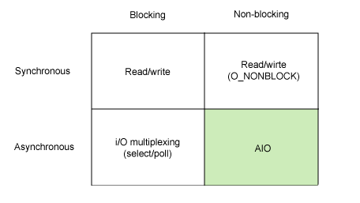

# 블럭과 논블럭

## 블럭과 논블럭? 그게 뭐징?

주로 동기와 비동기 와 함께 많이 소개 되는데요,, 저는 이번에 WebClient 를 공부하면서 처음 들어보았습니다.

저는 처음 개념을 접했을 때 동기-블럭, 비동기-논블럭 으로 이해했는데 오산이었습니다.

이번 정리를 통해 앞으로 혼용하는 일을 방지하고자 합니다.

`블럭`과 `논블럭`의 차이를 정확히 이해하려면 `동기`와 `비동기`를 알고 있어야 합니다.

> 이 포스팅은 동기와 비동기의 차이를 알고 있다는 전제하여 작성합니다.
> 

## 블럭 & 논블럭

블럭과 논블럭을 구분하는 가장 중요한 핵심은 `함수 제어권의 위치` 입니다.

예를 들어 함수 실행 순서가 A→B 인 로직이 있습니다.

- 블럭은 A함수를 호출하고 모든 행위를 마칠 때까지 기다렸다 종료되면 B함수를 호출합니다.
- 논블럭은 A함수를 호출하고 A함수가 끝나기도 전에 B함수를 호출합니다.

### 블럭(Block)

- 호출된 함수가 자신이 할 일을 모두 마칠 때까지 제어권을 계속 가지고서 호출한 함수에게 바로 제어권을return 하지 않으면 경우**

### 논블럭(Non-Block)
- 호출된 함수가 자신이 할 일을 마치지 않았더라도 바로 제어권을 바로 return하여 호출한 함수가 다른 일을 진행할 수 있는 경우**

근데 저는 단편적인 예제로만은 동기, 비동기와 뭐가 다른지 확실히 이해하기 힘들더라구요

그래서 아래 4가지 상황으로 구체적으로 살펴보겠습니다.

- 이때 동기와 비동기의 호출된 함수를 신경쓰는 여부를 인지해주셨으면 좋겠습니다.



> 전체적인 상황을 카페에서 음료를 시켰을 때로 설정하겠습니다.
> 

### 동기 / 블럭

```json
손님  : 딸기라떼 주문
직원 : 만드는 중
손님  : 테이블에 못가고 기다리는 중(음료가 언제나오는지 궁궁함)
```

이때 포인트는 손님은 음료가 언제나오는지 궁금해합니다.

이렇듯 동기/블럭은 함수가 끝날 때 까지 다른일을 못하고 있습니다. 효율적이지 못해 보입니다.

### 비동기 / 블럭

```json
손님 : 딸기라테 주문
직원 : 만드는 중
손님 : 테이블에 못가고 기다리는 중(음료가 언제나오는지 궁궁하지 않음)
```

비동기/논블럭은 언뜻 동기/블럭과 비슷해 보입니다. 하지만 손님은 음료가 언제 나오는지 궁금하지 않습니다.

→ 기존 작업이 끝날때까지 기다려야 합니다.

결과적으론 동기/블럭 과 똑같아 보입니다. (비효율)

### 동기 / 논블럭

```json
손님 : 딸기라떼 주문
직원 : 만드는 중
손님 : 테이블엔 갔지만 다른 할일을 못하고 계속 음료가 나왔는지 확인한다
```

비동기/블럭은 일단 함수의 제어권은 다음 함수로 갔지만, 다른 작업과의 동기를 위하여 다음 작업을 수행 못하고 기존 작업을 계속 신경써야 합니다.

→ 기존 작업이 끝날때까지 기다려야 합니다.

함수의 제어권은 넘어 갔지만 효율이 나오지 않습니다…

### 비동기 / 논블럭

```json
손님 : 딸기라떼 주문
직원 : 만드는 중
손님 : 테이블에 가서 할일을 하다 음료가 완성되면 가지러 간다
```

이렇듯 어떤 작업중 다른 작업을 동시에 할 수 있습니다.

자원이 충분하다면 효율이 좋아 보입니다.

대규모 서비스나, 동기가 필요하지 않을 때 효과적일거 같습니다.

이렇듯 상황에 따라 동기-비동기, 블럭-논블럭 을 유동적으로 사용하는 것이 좋아 보입니다.

무조건 비동기-논블럭이 좋다는 것이 아닌, 서비스에 따라 잘 판단하여 사용하는 것이 중요합니다.
