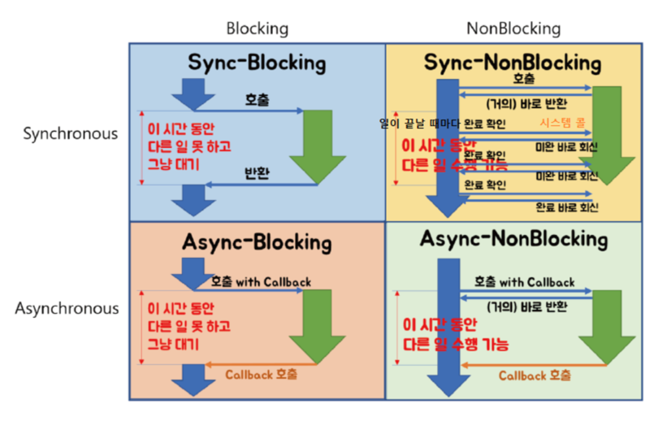
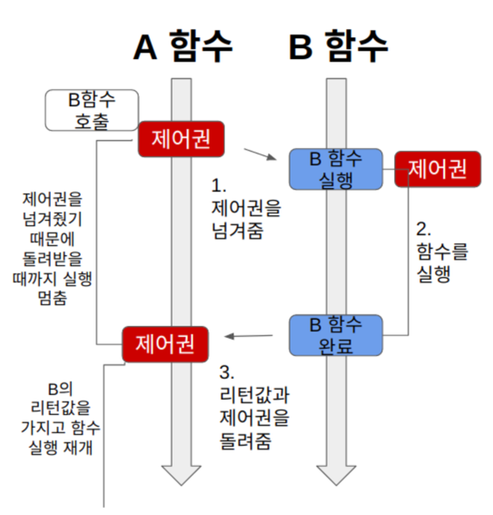
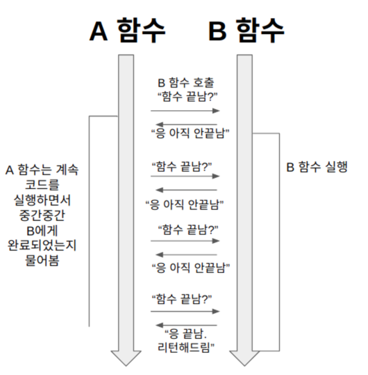
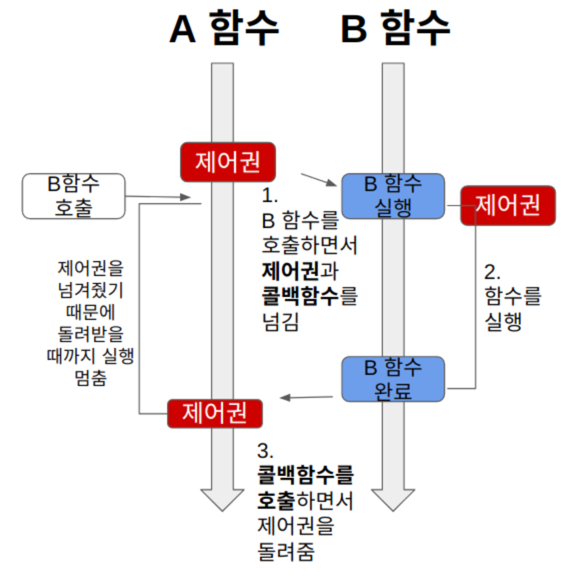
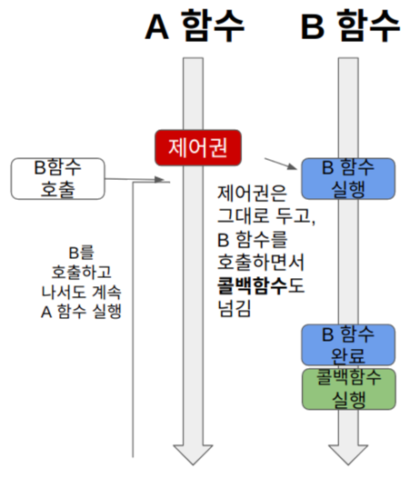

이번 스터디에서는 많이 헷갈려하는 동기와 비동기, 그리고 블로킹과 논블로킹에 대해 자세히 알아보고자 한다. 정신 잘 차리고 따라오자.

스터디에 앞서, 이 주제를 공부할 때 유의해야 할 점이 하나 있다. 동기와 블로킹, 비동기와 논블로킹을 비슷한 것으로 오해하고 있는데, 이 두가지 개념은 **서로 전혀 다른 곳에 초점**을 둔 개념이다. 단지 조합하여 사용되는 것뿐이다.

동기와 비동기는 `프로세스의 수행 순서 보장`에 대한 매커니즘이고, 블로킹과 논블로킹은 `프로세스의 유휴 상태`에 대한 개념이다.

## 선행지식
* [프로세스와 스레드](../processthread/introduce.md)
* 제어권 : 자신(함수)의 코드를 실행할 권리 같은 것. 제어권을 가진 함수는 자신의 코드를 끝까지 실행한 후, 자신을 호출한 함수에게 돌려준다.
* 결과값을 기다린다는 것 : A 함수에서 B 함수를 호출했을 때, A 함수가 B 함수의 결과값을 기다리느냐의 여부.

## Blocking vs Non-Blocking
* 블로킹과 논블로킹을 논할 때, 처리하는 작업이 **전체적인 작업 흐름을 막는지**에 대해 생각한다.
* 즉, `제어권`이 누구한테 있느냐가 관심사이다.

### 블로킹
* 자신의 작업을 진행하다가, 다른 주체의 작업이 시작되면 자신의 작업을 멈추고 해당 작업을 기다렸다가 다시 자신의 작업을 시작한다.
* A 함수가 B 함수를 호출하면, 제어권을 A가 호출한 B 함수에 넘겨준다.

### 논블로킹
* 다른 주체의 작업에 관련없이 자신의 작업을 한다.
* A 함수가 B 함수를 호출해도, 제어권은 A 함수가 그대로 갖고 있는다.
* B 함수는 호출되어 실행되는 동시에, A 함수가 제어권을 계속 가지기 때문에 자신의 코드를 계속 실행한다.

## Sync vs Async
* 처리해야 할 작업들을 어떠한 `흐름`으로 처리할 것인가에 대한 관점
* 다른 말로는 **호출하는 함수의 작업 완료 여부를 신경쓰는지**에 대해 생각한다.

### 동기 (Synchronous)
* 작업을 동시에 수행하거나, 동시에 끝나거나, 끝나는 동시에 시작
* 함수 A가 함수 B를 호출한 뒤, 함수 B의 리턴값을 계속 확인하면서 신경쓰는 것이다.

### 비동기 (Asynchronous)
* 시작, 종료가 일치하지 않으며, 끝나는 동시에 시작을 하지 않음
* 함수 A가 함수 B를 호출할 때 콜백 함수를 함께 전달해서, 함수 B의 작업이 완료되면 함께 보낸 콜백 함수를 실행한다.
* 함수 A는 함수 B를 호출한 이후로, 함수 B의 작업 완료 여부에는 신경쓰지 않는다.

## 동기, 비동기, 블로킹, 논블로킹 조합하기
* 블로킹과 논블로킹의 차이는 다른 함수 실행 시간동안 내 일을 못하고 대기하느냐, 내 일을 수행할 수 있느냐이다.
* 동기와 비동기의 차이는 반환값에 관심이 있느냐 없느냐이다.

### Sync-Blocking
* 함수 A는 함수 B의 리턴값을 필요로 한다. (동기)
* 그래서 제어권을 함수 B에게 넘겨주고, 함수 B가 실행을 완료하여 리턴값과 `제어권`을 돌려줄 때까지 기다린다. (블로킹)

### Sync-Nonblocking
* 함수 A는 함수 B를 호출한다. 이때 함수 A는 함수 B에게 `제어권`을 주지 않고, 자신의 코드를 계속 실행한다. (논블로킹)
* 그런데 함수 A는 함수 B의 리턴값이 필요하기 때문에, 중간중간 함수 B에게 실행을 완료했는지 물어본다. (동기)

### Async-Blocking
* 함수 A는 함수 B의 리턴값에 신경쓰지 않고, `콜백 함수`를 보낸다. (비동기)
* 그런데, B 함수의 작업에 관심이 없음에도 불구하고, 함수 A는 함수 B에게 `제어권`을 넘긴다. (블로킹)
* 결국 함수 A는 자신과 관련이 없는 함수 B의 작업이 끝날 때까지 기다려야 한다.
* (사용하는 경우는 거의 없다. 논블로킹으로 개발하려다 실수하는 경우 발생한다.)

### Async-Nonblocking
* 함수 A가 B를 호출할 때, `제어권`을 B에 주지 않고 자신이 계속 가지고 있는다. 그러므로 A는 자신의 코드를 계속 실행한다. (논블로킹)
* 그리고 B 함수를 호출할 때 `콜백 함수`를 함께 준다. B 함수는 자신의 작업이 끝나면 A 함수가 준 콜백 함수를 실행한다. (비동기)

#### References
* https://velog.io/@nittre/%EB%B8%94%EB%A1%9C%ED%82%B9-Vs.-%EB%85%BC%EB%B8%94%EB%A1%9C%ED%82%B9-%EB%8F%99%EA%B8%B0-Vs.-%EB%B9%84%EB%8F%99%EA%B8%B0
* https://github.com/Seogeurim/CS-study/blob/main/contents/operating-system/README.md
* https://inpa.tistory.com/entry/%F0%9F%91%A9%E2%80%8D%F0%9F%92%BB-%EB%8F%99%EA%B8%B0%EB%B9%84%EB%8F%99%EA%B8%B0-%EB%B8%94%EB%A1%9C%ED%82%B9%EB%85%BC%EB%B8%94%EB%A1%9C%ED%82%B9-%EA%B0%9C%EB%85%90-%EC%A0%95%EB%A6%AC