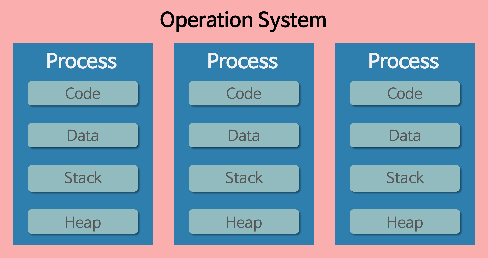
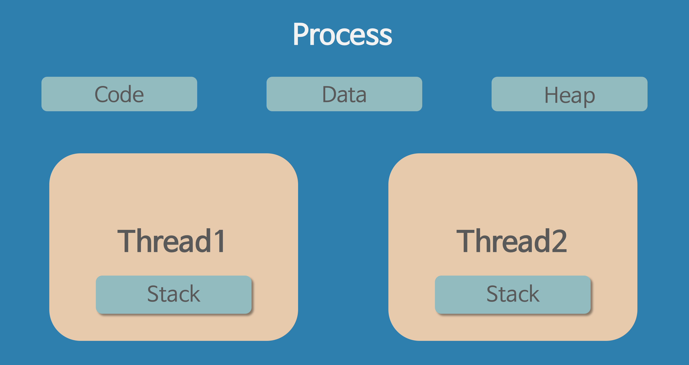
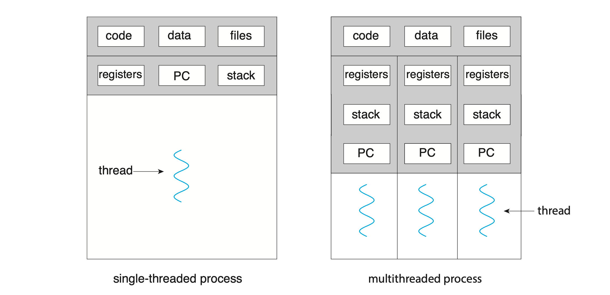
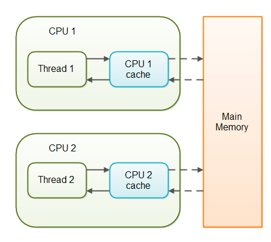
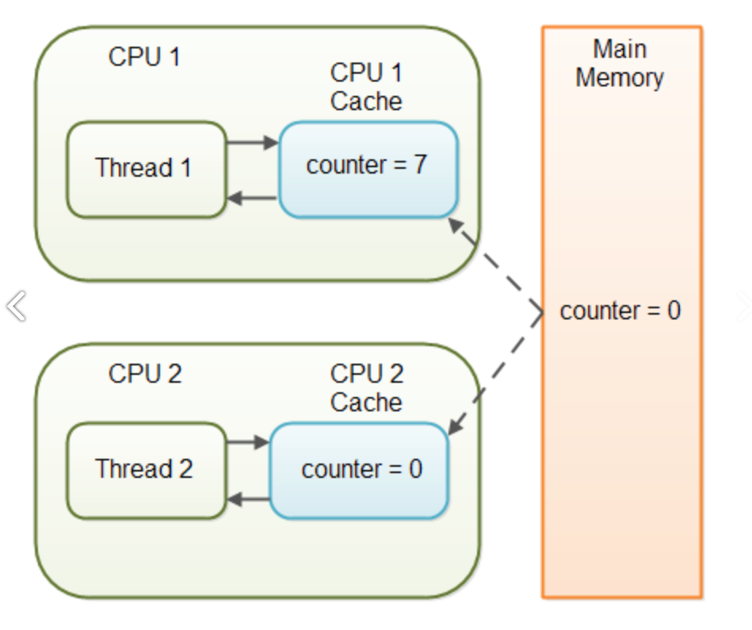

이번 스터디에서는 개발하는 데에 있어 가장 기본적인, 멀티스레드 및 멀티프로세스, 동기와 비동기 등을 이해하기 위한 필수 지식 `프로세스`와 `스레드`에 대해 알아보고자 한다.

## 요약
* `프로그램` : 파일 단위로 저장 장치에 저장되어 있으며, 아직 실행되지 않은 상태의 코드 덩어리를 말함.
* `프로세스` : 실행 중인 프로그램. 프로그램을 실행하기 위해 필요한 주소 공간, 파일, 메모리 등을 운영체제로부터 할당받은 프로그램을 프로세스라고 함.
* `스레드` : 프로세스의 실행 단위. 같은 프로세스 내에 있는 스레드끼리는 프로세스의 자원을 공유할 수 있음.

## 프로세스 (Process)
프로세스는 운영체제로부터 메모리 공간을 할당받아 실행 중인 프로그램이다. 즉, `실행된 프로그램`을 의미한다.

* 프로세스는 각각 독립된 메모리 영역(`Code, Data, Stack, Heap`)을 할당받는다.
* 기본적으로 프로세스당 최소 1개의 스레드를 가지고 있다.
* 각 프로세스는 별도의 주소 공간에서 실행되며, 한 프로세스는 다른 프로세스의 변수나 자료구조 등에 접근할 수 없다.
* 한 프로세스가 다른 프로세스의 자원에 접근하려면 프로세스 간 통신(IPC, Inter-Process Communication)을 사용해야 한다.

참고) IPC에는 `공유 메모리(shared memory)`, `메시지 전달(message passing)`의 두가지 모델이 있다.

* 공유 메모리 : 프로세스가 공유하는 메모리 영역이 설정되며, 각 프로세스는 공유 영역에서 데이터를 읽고 쓰는 방식으로 정보를 교환할 수 있다.
* 메시지 전달 : 프로세스 간 메시지를 교환하며 통신한다. (파이프, 소켓 등을 이용한 통신)



#### 프로세스에 할당되는 메모리 영역
* `코드(Code) 영역` : 프로세스가 실행할 코드가 기계어의 형태로 저장된 공간이다. (컴파일 타임에 결정, Read-only)
* `데이터(Data) 영역` : 전역 변수, static 변수 등이 저장된 공간. 젼역 변수, static 변수를 참조한 코드는 컴파일 후 그 데이터의 주소값을 가리킨다. (컴파일 타임에 결정, Read-Write)
* `스택(Stack) 영역` : 지역 변수, 매개변수, 리턴값, 복귀 주소 등이 저장된다. LIFO 방식에 따라 함수 호출 시 기록하고 함수가 종료되면 제거한다. (컴파일 타임에 결정, 정해진 크기가 있으므로 Stack Overflow 에러 발생 가능함)
* `힙(Heap) 영역` : 프로그래머가 관리하는 메모리 영역, 이 영역에 메모리를 할당하는 것을 동적 할당이라고 한다. (런타임에 결정, 스택보다 할당할 수 있는 메모리 공간이 많지만 데이터 Read/Write가 느림)

#### PCB
PCB(Process Control Block)는 특정 프로세스에 대한 정보를 담고 있는 운영체제의 자료구조이다. 프로세스는 운영체제의 스케쥴링 알고리즘에 따라 CPU를 할당받으며, 작업을 진행하다가 프로세스 전환이 발생하면 하던 일을 저장하고 CPU를 반환해야 한다.
또한 나중에 스케쥴링에 의해 재실행되었을 때 이전에 어디까지 작업했는지를 기억해야 한다. 그 정보가 담긴 공간이 `PCB`이다. 프로세스 생성과 동시에 그 프로세스의 고유한 `PCB`도 함께 생성된다.

아래는 PCB에 저장되는 정보이다.

* 프로세스 식별자 (PID)
* 프로세스 상태 (Process State) : new, ready, running, waiting, terminated
* 프로그램 카운터 (PC) : 프로세스가 다음에 실행할 명령어의 주소를 가리킴
* CPU 레지스터 : Accumulator, Index Register, 범용 레지스터 등
* **CPU 스케쥴링 정보** : 프로세스 우선순위, 최종 실행 시각, CPU 점유 시간 등
* 메모리 관리 정보 : Page table, Segment table 등
* 계정 정보 : CPU 사용 시간, 제한 시간, 계정 번호 등
* 입출력 상태 정보 : 프로세스에 할당된 입출력 장치, 개방된 파일 목록 등

## 스레드 (Thread)
스레드는 프로세스를 구성하는 독립적인 실행 단위이다. 스레드는 같은 프로세스 내 다른 스레드와 메모리 영역을 공유할 수 있다.

* 스레드도 하나의 실행 흐름이므로 실행과 관련된 데이터가 필요하다.
  * 각 스레드의 독립적 공간 : `스레드 ID`, `프로그램 카운터(PC)`, `레지스터 집합`, `스택 영역`
  * 스레드들이 공유하는 공간 : `코드 영역`, `데이터 영역`, `힙 영역`, 기타 운영체제 자원(열린 파일, 신호 등)
* 각 스레드는 스택 영역을 통해 독립적인 실행 흐름을 가진다.
* 스레드는 `프로세스 메모리 영역`을 공유하기 때문에, 어떤 스레드 하나에서 오류가 발생하면 같은 프로세스 내 모든 스레드가 강제 종료된다. (프로세스는 독립적이라 다른 프로세스에 영향을 주지 않는다.)



---

## 멀티 프로세스 (Multi-Process)
하나의 응용 프로그램을 여러 개의 프로세스로 구성하여, 각 프로세스가 하나의 작업(Task)을 처리하도록 하는 것

#### 멀티 프로세스 예시 - 크롬 브라우저
대부분의 브라우저는 탭 브라우징을 지원한다. 만일 브라우저가 멑티 프로세스 구조를 가지지 않는다면, 하나의 탭에서 애플리케이션이 비정상 종료되었을 때 다른 모든 탭(전체 프로세스) 가 종료될 것이다.

크롬 브라우저는 멀티 프로세스 구조를 가지고 있다. 브라우저의 각 탭은 프로세스이며, 이들은 각자 독립적으로 실행된다. 아래와 같은 3가지 유형의 프로세스를 지원한다.
* 브라우저 프로세스 : UI 및 디스크, 네트워크 I/O를 관리한다. 크롬이 시작되면 새 브라우저 프로세스가 생성된다.
* Renderer 프로세스 : 웹 페이지 렌더링을 위한 로직(HTML, JavaScript, 이미지 등을 처리하는 로직)을 포함한다. 이때, 새 탭에서 열리는 각 웹사이트에 대해 새 Renderer 프로세스가 생성된다.
* 플러그인 프로세스 : Flash, QuickTime과 같은 플러그인 유형에 대해 플러그인 프로세스가 생성된다. 플러그인에 대한 코드, 연관된 Renderer, 브라우저 프로세스와 통신하는 추가 코드가 포함되어 있다.

#### 장점
* 여러 자식 프로세스 중 하나에 문제가 발생해도 그 자식 프로세스가 죽는 것 외에 다른 프로세스로 영향이 확산되지 않는다.

#### 단점
* `Context-Switching`에서의 오버헤드 (프로세스는 각각 독립된 메모리 영역을 할당받았기 때문에, 프로세스 사이에서 공유하는 메모리가 없어 캐시에 있는 모든 데이터를 리셋하고 다시 캐시 정보를 불러와야 한다.)
* 프로세스 사이의 비교적 복잡한 통신 기법 (IPC)

#### Context-Switching
CPU 코어를 다른 프로세스로 전환하기 위해 현재 프로세스의 상태 저장, 다른 프로세스의 상태 복원을 수행하는 작업을 말한다.
* `Context`는 CPU가 프로세스를 실행하기 위한 정보를 말하며, `PCB`에 저장되는 정보들이 해당된다.
* Context-Switching이 발생하면 커널이 이전 프로세스의 context를 그 프로세스의 PCB에 저장하고, 새롭게 실행할 프로세스에 저장된 context를 불러오게 된다.
* Context-Switching 수행 중에는 CPU의 자원이 어떤 프로세스에도 할당된 상태가 아니기 때문에, CPU가 아무 작업도 할 수 없다.

## 멀티 스레드 (Multi-Thread)
하나의 응용 프로그램을 여러 개의 스레드로 구성하고, 각 스레드로 하여금 하나의 작업을 처리하도록 하는 것이다.

* 윈도우, 리눅스 등 많은 운영체제들이 멀티 프로세싱을 지원하고 있지만, 멀티 스레딩을 기본으로 한다.
* 웹 서버는 대표적인 멀티 스레드 응용 프로그램이다.

#### 멀티 스레드 애플리케이션의 예시들
* `웹 서버 프로세스`는 클라이언트 요청이 들어오면 그 요청을 처리하기 위한 별도의 스레드를 생성한다. 이는 새 프로세스를 생성하는 것보다 비용 측면에서 훨씬 효율적이다.
* `운영체제의 커널`은 멀티스레드이다. Linux 시스템 부팅 시 여러 커널 스레드가 생성되고, 각 스레드는 장치 관리, 메모리 관리, 인터럽트 처리 등의 작업을 수행한다. (`ps -ef` 명령을 사용하여 실행 중인 Linux 시스템에서 커널 스레드를 표시할 수 있다.)
* `웹 브라우저`는 하나의 스레드에서 이미지나 텍스트를 출력하고, 다른 스레드에서는 네트워크를 통해 데이터를 검색한다.
* `워드 프로세서`는 그래픽을 표시하기 위한 스레드, 사용자의 키 입력에 응답하기 위한 스레드, 백그라운드에서 맞춤법 및 문법 검사를 수행하기 위한 스레드 등을 가질 수 있다.

#### 장점
* 시스템 자원 소모 감소 (프로세스를 사용하여 자원을 할당하는 시스템 콜이 줄어 자원을 효율적으로 관리할 수 있다.)
* 시스템 처리량 증가 (스레드 간 데이터를 주고받는 것이 간단해지고, 자원 소모가 줄어든다.)
* 간단한 통신 방법을 통한 프로그램 응답 시간 단축

#### 단점
* 자원 공유 시 자원 동기화 문제가 발생한다.
* 하나의 스레드에 문제가 발생하면 전체 프로세스가 영향을 받는다.

#### 동기화 문제란?
* 스레드는 프로세스의 코드/데이터/힙 영역을 공유하므로, 여러 스레드가 공유 변수를 사용할 경우 발생할 수 있는 충돌을 '동기화 문제'라고 한다.
* 프로세스와 달리 스레드 스케쥴링은 운영체제가 관리해주지 않기 때문에, 프로그래머가 적절한 기법을 직접 구현해야 한다.



## 자바 코드에서 Thread-safe

동기화 문제를 해결하기 위해서는 하나의 스레드 작업이 끝나기 전까지 다른 스레드에 제어권이 넘어가지 않도록 하는 것이 필요하다. 그래서 도입된 개념이 `임계영역` 및 `잠금(lock)`이다.

* 임계영역 : 프로세스 간에 공유 자원 접근에 있어 문제가 발생하지 않도록 **한 번에 하나의 프로세스만 이용**하게끔 보장해줘야 하는 영역
* 락(lock) : 하나의 스레드나 프로세스가 자원을 사용하고 있는 동안 잠금을 하여 접근을 못하게 하는 방식

공유 데이터를 사용하는 코드 영역을 임계 영역으로 지정하고, 공유 데이터가 가지고 있는 잠금(lock)을 획득한 하나의 스레드만 이 영역 내의 코드를 수행할 수 있게끔 한 후, 잠금(lock)을 획득했던 스레드가 영역 내에서 작업이 끝나면 영역을 벗어나 잠금(lock)을 다시 반납힌다.
그리고 다른 스레드가 반납된 잠금(lock)을 획득하여 임계영역 내에서 코드를 수행하게 된다.

자바에서는 올바른 동기화(스레드 세이프)를 위해 `synchronized` 블럭, `java.util.concurrent.locks`, `java.util.concurrent.automic` 패키지를 지원하고 있다.

### Synchronized 이용한 동기화

Synchronized 키워드를 이용해 임계영역을 설정한다. (메소드 전체를 임계 영역으로 지정하거나, 특정한 영역에만 선언할 수 있다.)

```java
// 1. 메서드 선언, 메서드 전체를 임계영역으로 지정
public synchronized void calcSum() {

}

// 2. 특정 영역에 선언, 특정 영역만 임계영역으로 지정
public void calc() {
    synchronized (참조변수) {
    
    }
}
```

자세한 예제를 살펴보자. 아래는 `synchronized`를 사용하지 않은 예제이다.

```java
// synchronized를 사용하지 않은 예제
public class SynchronizedSample {

    public static void main(String[] args) {
        Runnable run = new RunnableSample2();
        new Thread(run).start();
        new Thread(run).start();
    }
}

class Account {

    private int balance = 1000;

    public int getBalance() {
        return balance;
    }

    public void withdraw(int money) {
        if (balance >= money) { // (1)
            try {
                Thread.sleep(1000);
            } catch (InterruptedException e) {
                e.printStackTrace();
            }
            balance -= money;
        }
    }

    static class RunnableSample2 implements Runnable {

        Account account = new Account();

        @Override
        public void run() {
            while (account.getBalance() > 0) {
                // 100,200,300 중의 한 값을 임의로 선택하여 출금
                int money = (int) (Math.random() * 3 + 1) * 100;
                account.withdraw(money);
                System.out.println("잔액 : "+ account.getBalance());
            }
        }
    }
}


//결과 
잔액 : 900
잔액 : 900
잔액 : 300
잔액 : 300
잔액 : -100
잔액 : -100
```

위 예제에서 두 스레드는 하나의 계좌(Account)라는 공유 자원으로 돈을 인출하고 있다.

두 스레드가 동시에 작업중일 때, 첫번째 스레드가 if문을 통과해서 돈을 출금하는 동안 두번째 스레드는 if문을 검사하는 중이다.
두번째 스레드가 if문을 검사하는 순간에는 돈이 충분했지만, 출금을 진행하려고 하는 동안 첫번째 스레드가 이미 출금을 해버렸다. 그렇기에 음수 값이 나오는 것이다.

위의 예제에 `synchronized`를 통해 락을 걸어서 문제를 해결해보자.

```java
// 1. 메소드에 선언
public synchronized void withdraw(int money) {
    if (balance >= money) {
        try {
            Thread.sleep(1000);
        } catch (InterruptedException e) {
            e.printStackTrace();
        }
        balance -= money;
    }
}

// 2. 특정 영역만 임계구역으로 지정
public void withdraw(int money) {
    synchronized (this) {
        if (balance >= money) {
            try {
                Thread.sleep(1000);
            } catch (InterruptedException e) {
                e.printStackTrace();
            }
            balance -= money;
        }
    }
}

// 결과
잔액 : 900
잔액 : 700
잔액 : 400
잔액 : 300
잔액 : 100
잔액 : 0
```

위의 코드에서 withdraw 메서드만 수정했다. 여러번 실행해도 결과값이 음수가 나오지 않는다!
이렇게 메서드 또는 특정 영역에 synchronized를 선언해 임계영역을 지정하고, lock을 획득한 스레드 작업이 끝나기 전까지 다른 스레드가 접근하지 못하도록 하면 동기화를 할 수 있다.

(위의 코드에서 중요한 것. Account 클래스 내의 balance라는 변수가 public 이거나 setter 메서드가 있었다면 외부에서 접근 가능하므로 동기화 노력이 소용없어질 수 있다. 동기화를 위해서는 불변 객체로 선언해주는 것도 중요하다.)

임계 영역은 멀티스레드 프로그램의 성능을 좌우하기에, 가능하면 메서드 전체에 lock보다 **synchronized 블럭을 사용하여 임계 영역을 최소화**하는 것이 좋다.

### volatile 이용한 동기화

멀티코어 프로세서에는 코어마다 캐시를 가지고 있다. 코어는 메모리에서 읽어온 값을 캐시에 저장하고, 캐시에서 값을 읽어서 작업한다.
다시 같은 값을 읽어올 때에는 먼저 캐시에 있는지 확인하고 없을 때에만 메모리에서 읽어온다.
그렇기 때문에, 멀티스레드 환경에서 메모리에 있는 공유자원을 사용하려 해도 캐시 때문에 원하는 값이 나오지 않을 수 있다.

아래 그림은 CPU마다 캐시 영역을 가지고 있고, 스레드에서 값을 읽을 때마다 메인메모리가 아닌 캐시에 저장된 값을 읽어오는 것을 보여주는 그림이다.



변수 앞에 `volatile`을 붙이면 코어가 변수의 값을 읽어올 때 캐시 값을 읽어오는 것이 아니라 메모리에 있는 값을 읽어오기 때문에, 캐시와 메모리 간의 값 불일치 문제를 해결할 수 있다.



### Atomic

`java.concurrent.atomic` 패키지를 보면 원자적 연산을 수행할 수 있는 클래스들이 있다. Atomic 클래스들은 `Compare And Swap(CAS)` 기반으로 되어 스레드 세이프하다.

CAS란, 변수의 값을 할당하기 전에 기존의 값이 내가 예상한 값인지 확인하여 같은 경우에만 할당하는 알고리즘 기법이다. (값을 할당하기 전에 한번 더 검사)

#### References
* https://gmlwjd9405.github.io/2018/09/14/process-vs-thread.html
* https://github.com/Seogeurim/CS-study/blob/main/contents/operating-system/README.md
* https://wooono.tistory.com/522
* https://yeoonjae.tistory.com/entry/Java-%EB%A9%80%ED%8B%B0%EC%93%B0%EB%A0%88%EB%93%9C-%EB%8F%99%EA%B8%B0%ED%99%94-synchronized