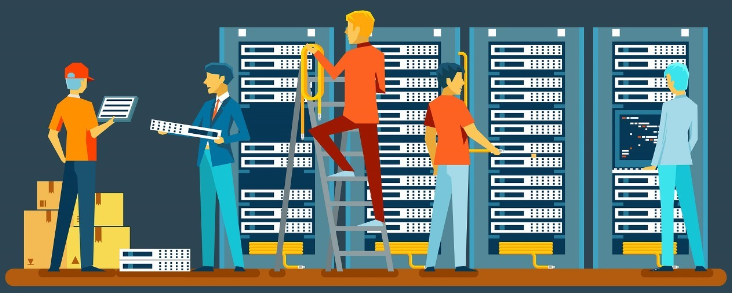
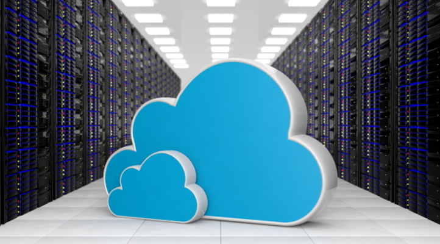
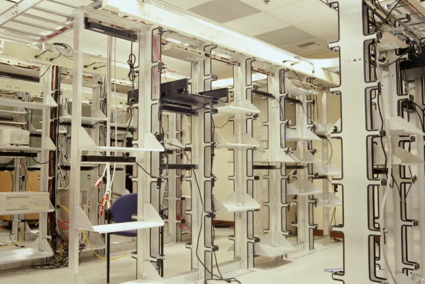
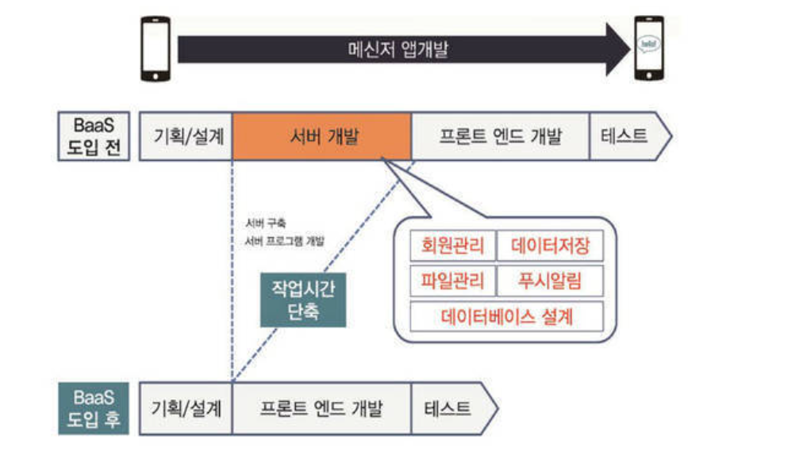
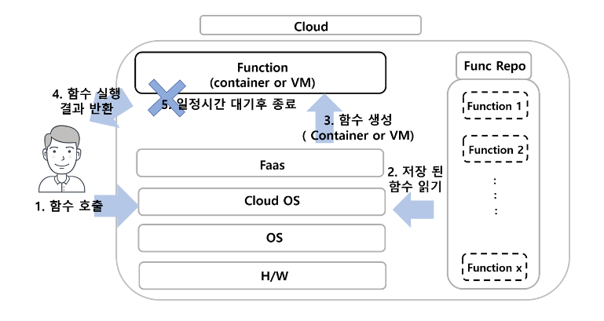
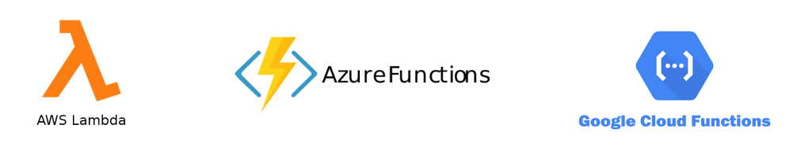

이번 스터디에서는 `서버의 구조` 중에서 사용자가 직접 서버를 관리 할 필요가 없는 클라우드 컴퓨팅의 모델 중 서버리스 구조에 대해서 자세히 알아본다.

---

## 서버리스 구조란?

- 서버가 없다 (직역)
- 클라우드 컴퓨팅의 모델 중 하나
- 사용자가 직접 서버를 관리 할 필요가 없는 모델

간단하게 서버리스 구조는 어떤 이벤트에 반응하는 함수를 등록하고 해당 이벤트가 발생되면 서버가 실행되는 구조이다. 이벤트에 반응하기 때문에 직접 관리를 할 필요가 없는 것이다.

---

## 서버리스의 탄생 배경

`온프레미스` : 직접 서버를 설치하는 것

`클라우드` : 클라우드 회사에 돈을 내고 최신식 서버를 빌려 사용하는 것

기존의 사람들은 서버를 `온프레미스`구조로 직접 설치하여 하드웨어, 소프트웨어의 모든 부분을 직접 관리하였다.

하지만 `온프레미스`구조는 하드웨어적인 관리 측면이 너무 번거롭고 힘든 상황이었다. 개발자들은 개발하기도 힘든데...

그래서 `클라우드`라는 것이 등장하게 되었다. `클라우드`를 사용을 하여 하드웨어적인 부분이나 서버 성능은 걱정하지 않게 되었다.

하지만 아직도 소프트웨어적으로는 사용자가 직접 관리를 하게 된다. 또한 서버를 가동만 시켜도 시간마다 결제가 되어 크나큰 지출을 하게 되었다.

그래서 등장한 것이 `서버리스`이다.  
`서버리스`는 특정 코드를 실행시키는데에 필요한 컴퓨팅 리소스와 스토리지 등을 동적으로 할당을 하고 그 부분에 대해서만 비용을 청구한다.

서버리스 방식

1. 개발자가 업로드한 함수는 휴먼상태(잠들어 있는 상태)로 들어가게 된다.
2. 특정 이벤트가 실행되면 함수를 실행하고 다시 휴먼상태로 전환한다.

이처럼 `서버리스`는 실제 사용한 자원에 대해서만 청구가 되어 경제적이며 자원적으로도 효율적으로 사용할 수 있게 되었다.

---

## 서버리스 모델 (BaaS / FaaS)

### Baas (Back-End As a Service)

`BaaS`는 앱/웹 개발에 있어 필요한 다양한 서버 기능을 API로 제공을 해줌으로써 서버개발을 직접하지 않고도 서버 기능을 사용할 수 있는 서비스이다.  
장점으로는 개발시간의 단축(회사의 입장), 서버확장의 불필요함이 있다.  
`BaaS`는 API의 호출 횟수만큼 지불하는 방식이다.

### FaaS (Function As a Service)

`FaaS`는 함수를 서비스로 제공한다. 사용자가 REST API와 같은 HTTP요청을 통해 함수를 호출하고 기존의 서버와 같이 동작할 수 있다.  
`FaaS`는 프로젝트를 여러개의 함수로 쪼개서 이 함수들이 실행되는 횟수만큼 비용을 지불하는 방식이다.

---

## 서버리스의 장단점

### 장점

1. 비용 절감
   - 실제 사용량에 대해서만 비용이 청구되어 필요없는 지출이 없다.
   - 필요한 상황에서 함수를 호출하여 불필요한 리소스 낭비가 없다.
2. 애플리케이션(클라이언트)의 품질에 집중 가능
   - 서버개발자는 해당 안됨
   - 클라이언트 개발자는 애플리케이션(클라이언트)에 대한 품질향상을 하는데 좀 더 집중을 할 수 있음
   - 풀스택이 되기 좋음
3. 높은 가용성과 유연한 확장
   - 요청이 들어올 때만 실행이 되고 동적으로 자원을 할당하여 가용성이 높다.
   - 동적으로 자원을 할당 받아 단기간 이벤트성 트래픽을 감당하는 경우 효과적이다.
4. 빠른 개발 배포
   - 간단한 패키징 및 배포
   - 릴리즈 주기 감소
   - 높은 생산성
   - 유지보수나 기능 개발에 효율적

### 단점

1. Cold Start
   - 항상 요청에 대기하는 것이 아니라 요청시간이 조금 느리다.
   - 실시간 서비스는 적합하지 않음
2. 긴 시간을 요하는 작업에 불리
   - 동영상 업로드, 데이터 백업 등 긴 시간이 필요한 작업에는 비효율적이다.
3. 로컬 데이터 사용 불가
   - 서버리스는 무상태(Stateless)적인 기능으로 구현되어야 한다.
4. 클라우드 제공 플랫폼에 심하게 종속적
   - 플랫폼을 이전하기 위해서는 애플리케이션의 구조자체를 바꿔야하기 때문에 다른 플랫폼으로 이전하는 것은 힘들다.

---

## 서버리스 제공 업체

- NaverCloudPlatform(NCP) : Cloud Functions
- AmazonWebServices(AWS) : AWS Lambda
- Microsoft Azure : Azure Functions
- GoogleCloudPlatform(GCP) : Google Cloud Functions
  

---

## 서버리스 사용 사례

### 배치 작업

- 데이터를 특정시간에 처리하는 기능을 서버리스로 구현하면 효율적이다.

### 자동화 작업

- 넷플릭스는 동영상 업로드 시 파일의 인코딩과 검증, 태깅 이후에 공개되는 작업을 AWS Lambda를 통해 자동화 했다.

### 분석과 모니터링 가능

- CPU 사용량이 임계치에 도달했을 때 알림을 받거나 지속적으로 기록되는 로그를 분석하고 리포팅 할때 서버리스를 사용할 수 있다.

### 챗봇 서비스

- API 호출 시 요청을 처리하고 유연한 확장이 가능해 많은 사용자에게 안정적인 서비스를 제공할 수 있다.

## 정리 (개인적인 생각 포함)

서버리스 구조가 어떤 것이고 또 어떤 장단점이 있는지와 어느 곳에서 사용하는지에 대해 알아보았다.

서버리스 구조가 나온지 몇년되지 않았지만 서버리스 구조가 무섭게 성장하고 있어 한번 깊게 알아보는 것이 좋다.

서버리스 구조의 장점은 사용자 입장에서는 확실히 좋다. 비용을 절감하고 애플리케이션의 품질 향상과 빠른 배포 등에서 안 쓸 이유가 별로 없다.  
이처럼 서버리스 구조는 점점 더 서버 시장에서 활발해져 많은 회사에서 사용될 것 같다는 개인적인 생각이다.
