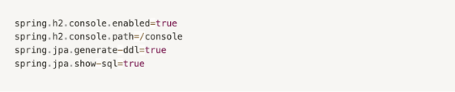

이번 스터디에서는 `스프링`과 `스프링부트`의 차이에 대해 자세히 알아본다

---

## Spring 공식 문서 내용

`Whatever happened next, the framework needed a name. In the book it was referred to as the “Interface21 framework” (at that point it used com.interface21 package names), but that was not a name to inspire a community. Fortunately Yann stepped up with a suggestion: “Spring”. His reasoning was association with nature (having noticed that I'd trekked to Everest Base Camp in 2000); and the fact that Spring represented a fresh start after the “winter” of traditional J2EE. We recognized the simplicity and elegance of this name, and quickly agreed on it.`

개발자들의 겨울은 끝났다.

---

## Spring FrameWork

- 자바 플랫폼을 위한 오픈소스 애플리케이션 프레임워크
- 전자정부 표준 프레임워크의 기반 기술
- 오픈소스 경량급 애플리케이션 프레임워크
- IoC (Invertion of Control) : 제어 역행
- DI (Dependency Injection) : 의존성 주입
- AOP (Aspect-Oriented Programming) : 관점지향 프로그래밍
- PSA (Portable Service Abstraction) : 일관된 서비스 추상화

---

## Spring Boot

- 스프링으로 애플리케이션을 만들 때에 필요한 설정들을 간편하게 처리해주는 별도의 프레임워크
- 스프링을 조금 더 쉽게 이용하기 위한 도구
- 비즈니스 로직을 작성하는 데 집중할 수 있음
- 웹 컨테이너를 내장하고 있어 최소한의 설정으로 웹어플리케이션을 만들 수 있다

### 스프링 부트는 튼튼한 프레임워크이다

스프링부트는 기본적으로 SQL인젝션, XSS, CSRF, 클랙재킹과 같은 보안 공격을 기본적으로 막아준다

```
- SQL인젝션 : 악의적인 SQL을 주입하여 공격하는 방법
- XSS : 자바스크립트를 삽입해 공격하는 방법
- CSRF : 위조된 요청을 보내는 공격 방법
- 클랙재킹 : 사용자의 의도하지 않은 클릭을 유도하는 공격 방법
```

### 스프링부트는 WAS가 따로 필요없다

기존에 스프링만 사용하여 개발하였다면 웹 어플리케이션을 실행할 수 있는 Web Application Server가 필요했다. 하지만 스프링부트는 기본적으로 톰캣 내장 서버가 있고 설정도 자동 적용되어 WAS가 따로 필요하지 않다.

```
WAS의 종류 : Tomcat, Weblogic, WebSphere, JBoss, Jeus 등
```

### 스프링부트는 설정이 쉽다

기존 스프링만을 사용하여 웹 애플리케이션을 개발하다보면 복잡한 설정이 많아 큰 어려움을 겪었다.


하지만 스프링부트는 이 복잡한 설정을 자동화하고 단순화시켜 사용자가 스프링을 사용할 때 복잡한 설정을 최대한 하지 않도록 만들었다.



---

## 스프링과 스프링부트의 차이

1. Embed Tomcat을 사용하여 따로 Tomcat을 설치하고 관리하는 번거로움을 줄여준다
2. SpringBoot Starter가 대부분의 Dependency를 관리해주기 때문에 호환되는 버전관리를 직접하는 번거로움을 덜었다.
3. XML 설정 (propertie 설정) 을 직접하지 않아도 된다.
4. jar 파일만을 사용하여 손쉽게 배포를 할 수 있다.

---

## 스프링부트 프로젝트 구조

#### src/main/java

- 자바 파일을 작성하는 디렉토리

#### OOOApplication.java

- 스프링부트 애플리케이션의 시작을 담당하는 파일
- `<프로젝트명>` + Application.java

#### src/main/resources

- 자바 파일을 제외한 환경파일을 작성하는 디렉토리

#### /static

- 정적파일을 저장하는 디렉토리
- .css .png/.jpg .js 등

#### application.properties / application.yml

- 프로젝트의 환경파일
- 데이터베이스, 환경변수 등의 내용을 작성

#### src/test/java

- 테스트 코드를 작성하는 디렉토리

#### build.gradle

- 그래들(Gradle)이 사용하는 환경파일
- 프로젝트를 위해 필요한 플러그인, 라이브러리 등을 기술한다
- Groovy를 기반으로 한 빌드 도구 (요즘은 Kotlin을 사용하기도 한다)

---

references

- https://spring.io/projects/spring-boot
- https://spring.io/projects/spring-framework#overview
- https://khj93.tistory.com/entry/Spring-Spring-Framework%EB%9E%80-%EA%B8%B0%EB%B3%B8-%EA%B0%9C%EB%85%90-%ED%95%B5%EC%8B%AC-%EC%A0%95%EB%A6%AC
- https://incomeplus.tistory.com/344
- https://server-engineer.tistory.com/739
- https://sas-study.tistory.com/274
- https://melonicedlatte.com/2021/07/11/174700.html
- https://goddaehee.tistory.com/238
- https://www.codestates.com/blog/content/%EC%8A%A4%ED%94%84%EB%A7%81-%EC%8A%A4%ED%94%84%EB%A7%81%EB%B6%80%ED%8A%B8
- https://wikidocs.net/160047
- https://velog.io/@courage331/Spring-%EA%B3%BC-Spring-Boot-%EC%B0%A8%EC%9D%B4
