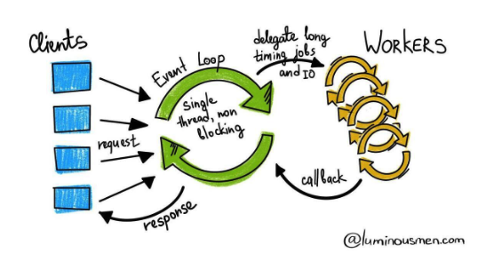

# WebClient

# Spring WebClient 란?

> API를 호출하기 위해 사용되는 Http Client 모듈 중 하나
> 

# 왜 WebClient 가 필요한가?

현재 Java에서 가장 많이 사용하는 Http Client는 `RestTemplate` 입니다.

그런데 Spring 5.0 버전부터는 `RestTemplate` 은 유지 관리 모드로 변경되었습니다.

Spring 에서는 `RestTemplate` 의 대안으로  `WebClient` 사용을 강력히 권고하고 있습니다.

`WebClient` 는 논블로킹/블로킹 모두 지원합니다.

# 동작 원리

> WebClient 의 동작 원리를 알려면 먼저, RestTemplate 의 동작 원리를 알아야 합니다.
> 

## RestTemplate

- Multi-Thread, Blocking


1. 요청 Thread Pool은 애플리케이션 구동 시에 미리 만들어 놓는다. 
2. Request는 먼저 Queue에 쌓이고 가용한 쓰레드가 있으면 그 쓰레드에 할당되어 처리된다.
    
    → 1개의 요청당 1개의 스레드 할당
    
3. 각 스레드는 Blocking 방식으로 처리되어 응답이 올때까지 그 스레드는 다른 요청에 할당 될 수 없다.

## WebClient

- Single-Thread, Non-Blocking
- 이벤트 반응형으로 동작
- Spring Web Reactive 모듈에 포함
- React Web 프레임워크인 Spring WebFlux 에서 Http Client로 사용됨



1. 각 요청은 Event Loop 내에 Job으로 등록이 된다.
2. Event Loop는 각 Job을 Worker에게 전달한 후, 결과를 기다리지 않고 다른 Job을 처리한다.
3. 결과를 기다리지 않아 대규모 서비스나, 외부 API호출이 잦은 서비스에 적합하다.

# WebClient 사용

저는 기존 RestTemplate 로 작성되어있던 코드들 WebClient로 바꾸는 것이라 따로 API 작성을 하지 않겠습니다.

## 의존성 추가

WebFlux 모듈 안에 WebClient가 포함되어 있습니다.

```java
implementation 'org.springframework.boot:spring-boot-starter-webflux'
```

## WebClient Config 작성

직접 생성자를 통해 WebClient을 기본 설정으로 생성할 수 있지만, 여러 서비스에서 사용할 것이고 설정도 추가로 해줘야하기 때문에 @Bean 으로 등록해주겠습니다.

전체코드

```java
@Configuration
public class WebClientConfig {

    DefaultUriBuilderFactory factory = new DefaultUriBuilderFactory(); 

    HttpClient httpClient = HttpClient.create()
            .option(ChannelOption.CONNECT_TIMEOUT_MILLIS, 10000); // 10초

    @Bean
    public WebClient webClient() {
        factory.setEncodingMode(DefaultUriBuilderFactory.EncodingMode.VALUES_ONLY);
        return WebClient.builder()
                .uriBuilderFactory(factory)
                .codecs(configurer -> configurer.defaultCodecs().maxInMemorySize(2 * 1024 * 1024))
                .clientConnector(new ReactorClientHttpConnector(httpClient))
                .build();
    }

    @Bean
    public ConnectionProvider connectionProvider() {
        return ConnectionProvider.builder("http-pool")
                .maxConnections(100)
                .pendingAcquireTimeout(Duration.ofMillis(0))
                .pendingAcquireMaxCount(-1)
                .maxIdleTime(Duration.ofMillis(1000L))
                .build();
    }
}
```

HttpClient 총 연결 시간을 10초로 설정

```java
HttpClient httpClient = HttpClient.create()
            .option(ChannelOption.CONNECT_TIMEOUT_MILLIS, 10000); // 10초
```

GET 요청의 파라미터 셋팅을 하기 위한 URI 템플릿의 인코딩을 위한 설정

```java
DefaultUriBuilderFactory factory = new DefaultUriBuilderFactory(); 

factory.setEncodingMode(DefaultUriBuilderFactory.EncodingMode.VALUES_ONLY);
```

Spring WebFlux 에서는 애플리케이션 메모리 문제를 피하기 위해 in-memory buffer 값이 256KB로 기본설정 되어 있습니다. 256KB 보다 큰 HTTP 메시지를 처리 시도 → `DataBufferLimitException` 에러 발생

이 값을 늘려주기 위한 설정

```java
.codecs(configurer -> configurer.defaultCodecs().maxInMemorySize(2 * 1024 * 1024))
```

TCP 통신 과정시 HandShake 과정 중 정상적으로 닫히지 않았는데 요청을 보내어 `Connection prematurely closed BEFORE response` 에러 방지를 위해 커넥션풀 설정 (커넥션 풀을 먼저 끊는)

```java
@Bean
public ConnectionProvider connectionProvider() {
    return ConnectionProvider.builder("http-pool")
            .maxConnections(100)                    // connection pool의 갯수
            .pendingAcquireTimeout(Duration.ofMillis(0)) //커넥션 풀에서 커넥션을 얻기 위해 기다리는 최대 시간
            .pendingAcquireMaxCount(-1)             //커넥션 풀에서 커넥션을 가져오는 시도 횟수 (-1: no limit)
            .maxIdleTime(Duration.ofMillis(1000L))        //커넥션 풀에서 idle 상태의 커넥션을 유지하는 시간
            .build();
}
```

## WebClient Util 작성

우선 저는 GET, POST 요청만 필요하기 때문에 2가지만 작성해주었습니다.

전체코드

```java
@Component
@RequiredArgsConstructor
public class WebClientUtil {

    private final WebClientConfig webClientConfig;

    public <T> T get(String url, Class<T> responseDtoClass) {
        return webClientConfig.webClient().method(HttpMethod.GET)
                .uri(url)
                .retrieve()
                .onStatus(HttpStatus::is4xxClientError, clientResponse -> Mono.error(InternalServerException.EXCEPTION))
                .onStatus(HttpStatus::is5xxServerError, clientResponse -> Mono.error(InternalServerException.EXCEPTION))
                .bodyToMono(responseDtoClass)
                .block();
    }

    public <T, V> T post(String url, V requestDto, Class<T> responseDtoClass) {
        return webClientConfig.webClient().method(HttpMethod.POST)
                .uri(url)
                .bodyValue(requestDto)
                .retrieve()
                .onStatus(HttpStatus::is4xxClientError, clientResponse -> Mono.error(InternalServerException.EXCEPTION))
                .onStatus(HttpStatus::is5xxServerError, clientResponse -> Mono.error(InternalServerException.EXCEPTION))
                .bodyToMono(responseDtoClass)
                .block();
    }
}
```

유연한 Request, Response 를 위하여 반환형과 파라미터 타입을 제네릭으로 선언 해주었습니다.

각각 HttpMethod GET, POST 요청입니다.

```java
webClientConfig.webClient().method(HttpMethod.GET)
webClientConfig.webClient().method(HttpMethod.POST)
```

uri 설정과, RequestBod 설정 부분입니다

```java
uri(url)
.bodyValue(requestDto)
```

### **Response를 받아오기**

이 과정에는 두 방법이 있습니다.

- retrieve : Body만 가져온다.
- exchange : ClientResponse를 상태값 그리고 헤더와 함께 가져온다.

저는 Body 값만 필요하기 때문에 retrieve() 를 사용하겠습니다.

```java
.retrieve()
```

HttpStatus 400번대, 500번대 를 처리해주는 코드입니다. 저는 일단 500번 Server 에러로 처리해주었습니다.

```java
.onStatus(HttpStatus::is4xxClientError, clientResponse -> Mono.error(InternalServerException.EXCEPTION))
.onStatus(HttpStatus::is5xxServerError, clientResponse -> Mono.error(InternalServerException.EXCEPTION))
```

### **Response 값 변환**

값 변환에 있어서도 여러가지 방법이 있습니다.

- bodyToMono : Mono<T>
- bodyToFlux : Flux<T>
- toEntity : Mono<ResponseEntity<T>>

```java
.bodyToMono(responseDtoClass)
```

### Subscribe or Block

위에서 WebClient는 논블로킹/블로킹 둘 다 사용할 수 있다고 했었다.

- subscribe : 논블로킹
- block : T 변환, 블로킹
- toStream : Stream<T> 변환 - 블로킹
    - Lazy Subscribe를 통한 Stream또는 Iterable로 변환 시킬 수 있다. - 지연 차단
    - 근데 이것도 완벽히 Reactive한 것이 아니다. - block과 마찬가지로 블로킹…

근데 저는 블로킹하게 처리하고 싶지 않았습니다... subscribe()를 통해 처리해보려고 했지만 Spring MVC환경에서 Mono or Flux → 객체 변환 관련하여 어려움이 있습니다. 이건 추후 해결 되면 따로 포스팅 하겠습니다.

```java
.block();
```

## WebClient 호출

### POST 요청

```java
webClientUtil.post(
                jwtProperties.getTokenServer() + tokenProperties.getRefresh(),
                TokenRequestDto.builder()
                        .memberId(userId)
                        .accessLevel(accessLevel.getNumber())
                        .apiKeyAccessLevel(0)
                        .build(),
                MakeTokenRo.class)
        .getData().getToken();
```

### GET 요청

GET 요청은 url에 파라미터 동적 주입을 위해 WebClient Util 을 활용한 Template를 별도로 생성하였습니다.

```java
ResponseEntity<YoutubeApiRo> apiResult = youTubeWebClientTemplate.common(
        youtubeUrlProperties.getVideo(),
        videoId,
        YoutubeApiRo.class);
```

YouTubeWebClientTemplate 코드

```java
@Component
@RequiredArgsConstructor
public class YouTubeWebClientTemplate {

    private final WebClientUtil webClientUtil;
    private final YoutubeProperties youtubeProperties;

    public <T> ResponseEntity<T> common(String endPoint, String value, Class<T> responseDtoClass) {
        URI url = createUrl(endPoint, value);
        return webClientUtil.get(
YOUTUBE_SERVER.getEndpoint() + url,
                responseDtoClass
        );
    }

    private URI createUrl(String endPoint, String value) {
        return UriComponentsBuilder.fromUriString(endPoint)
                .build(youtubeProperties.getApiKey(), value);
    }
}
```

## 정리

WebClient는 논블로킹/블로킹 모두 지원하고 있어서 RestTemplate 보다 활용성이 뛰어나다고 생각하여 안 쓸 이유는 없는것 같습니다. 

이번 포스팅을 하면서 한가지 아쉬운점은.. WebClient의 비동기/논블로킹 을 적극적으로 활용해보고 싶었지만. 블로킹하게 처리한 점이 좀 아쉽네요. 이슈 얼른 해결하여 개선 포스팅 들고 돌아오겠습니다…!!